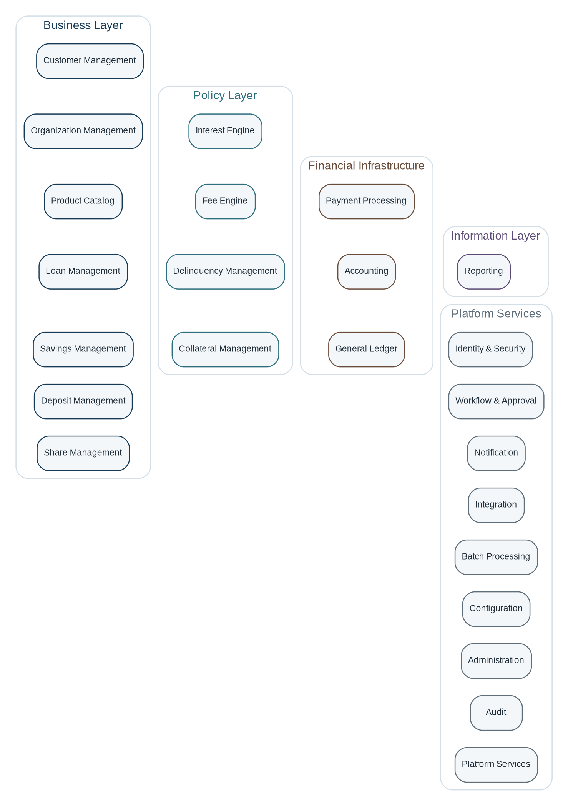

# Architecture and Reading Guide

A capability is a stable business responsibility with its own language, rules, state, and data ownership. A capability may be implemented as a module, service, bounded context, or group of components; the taxonomy intentionally does not prescribe deployment topology.

> **Interpretation Principle:** The domain model diagrams are conceptual ownership models. They identify the most important aggregates, entities, and value concepts, but they are not intended as physical database schemas.

## Common Chapter Structure

| **Purpose and scope**         | What the capability owns and the business outcomes it supports.                 |
|-------------------------------|---------------------------------------------------------------------------------|
| **Why it matters**            | The risk, value, control, or customer need that justifies the boundary.         |
| **Domain model**              | Primary aggregate roots, entities, value objects, and the authoritative record. |
| **Lifecycle and workflows**   | States, transitions, and representative end-to-end processes.                   |
| **Relationships**             | How the capability collaborates with upstream and downstream capabilities.      |
| **Distinctive aspects**       | Semantics and edge cases that commonly cause design errors.                     |
| **Commands and events**       | Representative write operations and published business facts.                   |
| **Invariants and guardrails** | Rules that must remain true regardless of implementation technology.            |

## Architecture at a Glance

The layers express responsibility rather than runtime call direction. Business capabilities own customer-facing contracts and operational state. Policy capabilities provide reusable calculations and classifications. Financial infrastructure moves and records value. Information capabilities expose read-oriented views. Platform services provide security, orchestration, integration, operations, evidence, and shared technical primitives.

## Cross-Capability Design Principles

- Ownership is explicit: each authoritative business fact has one capability that may change it.
- Commands request change; business events state that committed change has occurred.
- Operational subledgers and the General Ledger reconcile, but they serve different purposes.
- Configuration is versioned and effective-dated; it does not replace explicit domain concepts.
- Reversal preserves history. Financial records are corrected through compensating actions rather than deletion.
- Business date, posting date, value date, event time, and system time are distinct when the domain requires them.
- Cross-capability collaboration uses stable contracts, identifiers, and events rather than shared database ownership.
