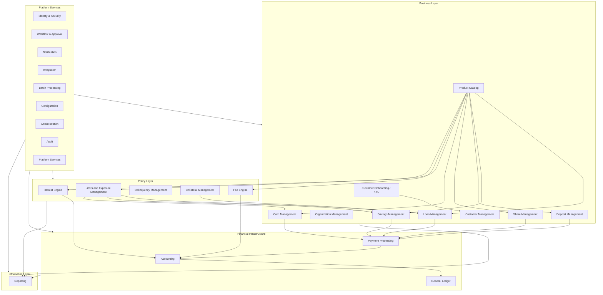

# Architecture and Reading Guide

A capability is a stable business responsibility with its own language, rules, state, and data ownership. A capability may be implemented as a module, service, bounded context, or group of components; the taxonomy intentionally does not prescribe deployment topology.

> **Interpretation Principle:** The domain model diagrams are conceptual ownership models. They identify the most important aggregates, entities, and value concepts, but they are not intended as physical database schemas.

## Common Chapter Structure

| **Section** | **Purpose** |
|---|---|
| **Purpose and scope** | What the capability owns and the business outcomes it supports. |
| **Why it matters** | The risk, value, control, or customer need that justifies the boundary. |
| **Domain model** | Primary aggregate roots, entities, value objects, and the authoritative record. |
| **Lifecycle and workflows** | States, transitions, and representative end-to-end processes. |
| **Relationships** | How the capability collaborates with upstream and downstream capabilities. |
| **Distinctive aspects** | Semantics and edge cases that commonly cause design errors. |
| **Commands and events** | Representative write operations and published business facts. |
| **Invariants and guardrails** | Rules that must remain true regardless of implementation technology. |

## Architecture at a Glance

The layers express responsibility rather than runtime call direction. Business capabilities own customer-facing contracts, access instruments, onboarding decisions, and operational state. Policy capabilities provide reusable calculations, classifications, limits, and exposure decisions. Financial infrastructure moves and records value. Information capabilities expose read-oriented views. Platform services provide security, orchestration, integration, operations, evidence, and shared technical primitives.

## Capability Set

| Layer | Capabilities |
|---|---|
| Business Layer | Customer Onboarding / KYC, Customer Management, Organization Management, Product Catalog, Loan Management, Savings Management, Deposit Management, Share Management, Card Management |
| Policy Layer | Interest Engine, Fee Engine, Delinquency Management, Collateral Management, Limits and Exposure Management |
| Financial Infrastructure | Accounting, Payment Processing, General Ledger |
| Information Layer | Reporting |
| Platform Services | Identity & Security, Workflow & Approval, Notification, Integration, Batch Processing, Configuration, Administration, Audit, Platform Services |

## Cross-Capability Design Principles

- Ownership is explicit: each authoritative business fact has one capability that may change it.
- Commands request change; business events state that committed change has occurred.
- Operational subledgers and the General Ledger reconcile, but they serve different purposes.
- Configuration is versioned and effective-dated; it does not replace explicit domain concepts.
- Reversal preserves history. Financial records are corrected through compensating actions rather than deletion.
- Business date, posting date, value date, event time, and system time are distinct when the domain requires them.
- Cross-capability collaboration uses stable contracts, identifiers, and events rather than shared database ownership.
- Onboarding evidence, customer master data, account contracts, card instruments, payment movements, and ledger entries have separate authoritative records.
- Product simulation supports product governance but does not replace live domain invariants.
- Limits and exposure decisions can span products and contracts, but product domains still own their contracts and transactions.

