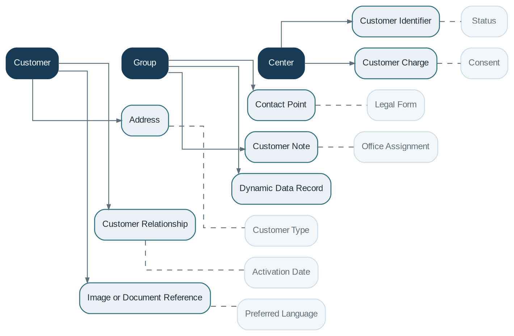

# Customer Management

> **Capability summary:** Manages the authoritative business identity and profile of people, legal entities, groups, and centers that interact with the institution. It provides the stable customer reference used by every product and service without owning the financial contracts themselves.

| Attribute | Value |
|---|---|
| Capability number | 01 |
| Category | Business Capability |
| Architectural layer | Business Layer |
| Primary record | Customer master and relationship history |
| Criticality | High |

## Purpose and Scope

- Onboard individual, legal-entity, group, and institutional customers.
- Maintain names, addresses, contact points, identifiers, relationships, notes, images, and configurable attributes.
- Control customer status, activation, transfer between offices, and closure.
- Provide a consistent customer reference for contracts, reporting, notifications, and audit.

## Why It Matters

- A bank cannot safely consolidate exposure, service history, consent, or risk information without a reliable customer master.
- Customer identity is shared across products; duplication creates fragmented balances, inconsistent reporting, and regulatory risk.
- The capability separates the person or organization from the accounts and contracts they hold, enabling a true customer-centric view.

## Domain Model

| **Aggregate or Core Concept** | **Responsibility**                                                                                    |
|-------------------------------|-------------------------------------------------------------------------------------------------------|
| **Customer**                  | Authoritative record for an individual or legal entity, including status and institutional ownership. |
| **Group**                     | Collective customer structure used for group lending, joint liability, or community-based operations. |
| **Center**                    | Operational grouping of customer groups, often used in microfinance field operations.                 |

### Supporting Entities

- Address
- Contact Point
- Customer Identifier
- Customer Relationship
- Customer Note
- Customer Charge
- Image or Document Reference
- Dynamic Data Record

### Value Objects and Policy Concepts

- Customer Type
- Legal Form
- Status
- Activation Date
- Office Assignment
- Consent
- Preferred Language
- External Identifier

## Lifecycle and Representative Workflows

> **Typical lifecycle:** Prospective → Submitted → Active → Inactive or Suspended → Transferred → Closed

1. Customer onboarding: capture identity, validate required data, assign office, approve, and activate.
2. Customer transfer: move institutional responsibility while preserving contracts and history.
3. Profile maintenance: apply controlled, auditable changes to identity and contact data.

## Relationships with Other Capabilities

| **Related capability**                          | **Interaction**                                                                                      |
|-------------------------------------------------|------------------------------------------------------------------------------------------------------|
| [**Organization Management**](../01-business-capabilities/02-organization-management.md)                     | Assigns the servicing office, center, and responsible staff.                                         |
| [**Identity & Security**](../05-platform-capabilities/03-identity-and-security.md)                         | May link a customer to a self-service digital identity, but does not authenticate the person itself. |
| [**Product Catalog**](../01-business-capabilities/04-product-catalog.md)                             | Supplies eligibility context and segmentation attributes used during product selection.              |
| **Loan / Savings / Deposit / Share Management** | Contracts reference the customer master as holder, borrower, member, guarantor, or beneficiary.      |
| [**Notification**](../05-platform-capabilities/18-notification.md)                                | Uses verified contact points, language, consent, and channel preferences.                            |
| **Reporting and Audit**                         | Consume the customer reference to produce consolidated views and trace changes.                      |

## Distinctive Aspects and Peculiarities

- Customer, account holder, authorized signatory, beneficiary, and guarantor are distinct roles and should not be collapsed.
- Individual, legal-entity, and group customers require different mandatory data and validation rules.
- Identifiers should be typed, unique within an agreed scope, and protected against silent reuse.
- Profile data often requires effective dating, privacy controls, retention rules, and masking.
- KYC and AML processes may integrate with this capability, but their case-management logic is usually a separate compliance domain.

## Representative Commands and Business Events

### Commands

- Create Customer
- Submit Customer
- Activate Customer
- Update Profile
- Add Identifier
- Add Address
- Transfer Customer
- Close Customer

### Business Events

- Customer Created
- Customer Activated
- Customer Profile Changed
- Customer Transferred
- Customer Closed

## Key Invariants and Design Guardrails

- Every active customer has a unique internal identifier.
- A customer cannot be activated until mandatory attributes for its type are complete.
- Closing a customer must not orphan active contracts or unresolved obligations.
- Historical identifiers and status transitions remain auditable.

> **Boundary:** Customer Management owns the customer master. It must not own loan balances, savings transactions, product rules, authentication credentials, or accounting entries.
