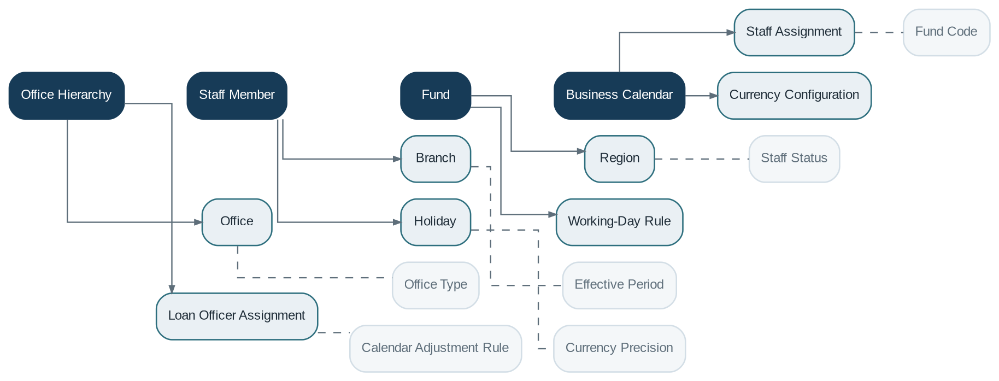

# Organization Management

> **Capability summary:** Represents the institution’s operating structure: offices, branches, hierarchy, staff, loan officers, funds, working days, holidays, currencies, and other organizational reference data that shape where and by whom banking activity is performed.

| Attribute | Value |
|---|---|
| Capability number | 02 |
| Category | Business Capability |
| Architectural layer | Business Layer |
| Primary record | Office hierarchy, staff assignments, and business calendars |
| Criticality | High |

## Purpose and Scope

- Maintain the office hierarchy and organizational units.
- Manage staff, operational roles, and staff-to-office assignments.
- Define working days, holidays, and calendars used by products and batch processing.
- Maintain funds, currencies, and organization-level categories used throughout the core.

## Why It Matters

- Nearly every transaction must be attributed to an organizational unit for accountability, permissions, accounting, and reporting.
- Calendars and business-day rules affect repayment dates, maturity, interest, fees, and end-of-day processing.
- A consistent hierarchy enables consolidated reporting from branch to region to institution.

## Domain Model

| **Aggregate or Core Concept** | **Responsibility**                                                                |
|-------------------------------|-----------------------------------------------------------------------------------|
| **Office Hierarchy**          | Tree of organizational units with controlled parent-child relationships.          |
| **Staff Member**              | Operational person assigned to one or more offices and business responsibilities. |
| **Fund**                      | Named source or pool of funds used for portfolio attribution and reporting.       |
| **Business Calendar**         | Working-day and holiday model applied by financial operations.                    |

### Supporting Entities

- Office
- Branch
- Region
- Staff Assignment
- Loan Officer Assignment
- Holiday
- Working-Day Rule
- Currency Configuration
- Provisioning Category

### Value Objects and Policy Concepts

- Office Type
- Effective Period
- Staff Status
- Fund Code
- Calendar Adjustment Rule
- Currency Precision

## Lifecycle and Representative Workflows

> **Typical lifecycle:** Defined → Activated → Reorganized or Reassigned → Deactivated

1. Office setup: create unit, position it in the hierarchy, assign calendars and operational parameters, then activate.
2. Staff assignment: onboard staff, associate offices and duties, and manage effective dates.
3. Calendar maintenance: publish working days and holidays before dependent schedules are generated.

## Relationships with Other Capabilities

| **Related capability**       | **Interaction**                                                        |
|------------------------------|------------------------------------------------------------------------|
| [**Customer Management**](../01-business-capabilities/01-customer-management.md)      | Customers are owned and serviced through an office or center.          |
| [**Identity & Security**](../05-platform-capabilities/03-identity-and-security.md)      | Roles and permissions are often constrained by office scope.           |
| **Loan and Deposit Domains** | Contracts record branch, officer, and fund attribution.                |
| [**Batch Processing**](../05-platform-capabilities/20-batch-processing.md)         | Uses business calendars and organization cut-off rules.                |
| **Accounting and Reporting** | Aggregate postings and performance by office, staff, region, and fund. |
| [**Administration**](../05-platform-capabilities/22-administration.md)           | Operates the organization model but does not replace it.               |

## Distinctive Aspects and Peculiarities

- The office hierarchy is usually a strict tree, but reporting may require additional matrix dimensions.
- Staff identity is not the same as a login account; employment and authorization lifecycles differ.
- Assignments should be effective-dated so historical transactions retain their original organizational attribution.
- Holiday changes after schedules are created require controlled rescheduling rules.
- Organization data is shared reference data and must be highly stable.

## Representative Commands and Business Events

### Commands

- Create Office
- Move Office
- Activate Office
- Create Staff
- Assign Staff
- Define Holiday
- Configure Working Days
- Create Fund

### Business Events

- Office Activated
- Office Reorganized
- Staff Assigned
- Calendar Changed
- Fund Created

## Key Invariants and Design Guardrails

- An active office has exactly one valid parent except the root institution.
- An office cannot be deactivated while dependent operational responsibilities remain unresolved.
- Historical transactions retain the office and staff attribution valid when they occurred.
- Calendars cannot contain contradictory working-day and holiday definitions.

> **Boundary:** Organization Management owns institutional structure and operational reference data. It does not authenticate users or execute financial transactions.
