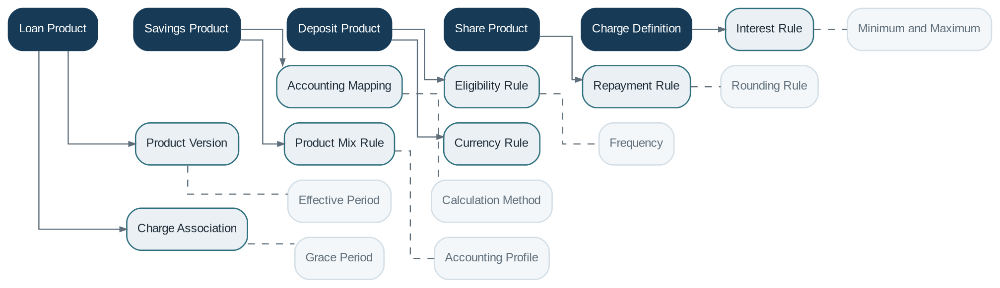

# Product Catalog

> **Capability summary:** Defines reusable, versioned templates for financial products. A product specifies commercial terms, eligibility, interest, repayment, charge, accounting, and operational configuration from which customer contracts are created.

| Attribute | Value |
|---|---|
| Capability number | 04 |
| Category | Business Capability |
| Architectural layer | Business Layer |
| Primary record | Versioned financial product definitions |
| Criticality | High |

## Purpose and Scope

- Define loan, savings, current-account, fixed-deposit, recurring-deposit, and share products.
- Associate interest, fees, accounting mappings, currencies, limits, and schedules.
- Manage product compatibility, product mix, effective dates, and retirement.
- Provide controlled defaults and constraints for contract origination.

## Why It Matters

- Product configuration is the primary mechanism for launching differentiated offerings without rewriting core code.
- It separates reusable policy from individual customer contract state.
- Versioned products make historical calculations and contractual terms reproducible.

## Domain Model

| **Aggregate or Core Concept** | **Responsibility**                                                          |
|-------------------------------|-----------------------------------------------------------------------------|
| **Loan Product**              | Template for lending terms, schedules, allocation, charges, and accounting. |
| **Savings Product**           | Template for transactional deposit accounts, interest, overdraft, and fees. |
| **Deposit Product**           | Template for fixed or recurring contractual deposits and maturity rules.    |
| **Share Product**             | Template for member equity, issuance, redemption, and dividend constraints. |
| **Charge Definition**         | Reusable fee or penalty definition.                                         |
| **Floating Rate**             | Effective-dated reference rate and spread model.                            |

### Supporting Entities

- Product Version
- Accounting Mapping
- Eligibility Rule
- Repayment Rule
- Interest Rule
- Charge Association
- Product Mix Rule
- Currency Rule

### Value Objects and Policy Concepts

- Effective Period
- Calculation Method
- Frequency
- Rounding Rule
- Minimum and Maximum
- Grace Period
- Accounting Profile

## Lifecycle and Representative Workflows

> **Typical lifecycle:** Draft → Reviewed → Approved → Active → Suspended for New Sales → Retired

1. Product design: compose terms, policies, charges, accounting, and eligibility into a draft version.
2. Product approval: validate internal consistency and authorize the version for use.
3. Contract origination: copy or reference the effective product terms into a new customer contract.

## Relationships with Other Capabilities

| **Related capability**                          | **Interaction**                                                               |
|-------------------------------------------------|-------------------------------------------------------------------------------|
| [**Interest Engine**](../02-policy-capabilities/11-interest-engine.md)                             | Supplies calculation methods, rate plans, day-count, and posting conventions. |
| [**Fee Engine**](../02-policy-capabilities/12-fee-engine.md)                                  | Supplies charge definitions, triggers, schedules, and waiver rules.           |
| [**Accounting**](../03-financial-infrastructure/09-accounting.md)                                  | Consumes product-to-ledger mappings and posting profiles.                     |
| **Loan / Savings / Deposit / Share Management** | Instantiate contracts from effective product versions.                        |
| [**Configuration**](../05-platform-capabilities/21-configuration.md)                               | Provides institution-wide defaults, feature flags, and code tables.           |
| [**Reporting**](../04-information-capabilities/16-reporting.md)                                   | Uses product hierarchy and versions as primary analytical dimensions.         |

## Distinctive Aspects and Peculiarities

- Products are templates, not accounts: they do not own balances or transaction history.
- Existing contracts should not silently inherit changed product terms unless the contract explicitly references dynamic policy.
- Effective-dated versions are preferable to in-place mutation of active products.
- Cross-field validation is essential; individually valid parameters may form an impossible schedule or accounting setup.
- Product mix rules can prevent incompatible combinations for a customer or group.

## Representative Commands and Business Events

### Commands

- Create Product Draft
- Add Charge
- Configure Accounting
- Define Eligibility
- Approve Product Version
- Activate Product
- Retire Product

### Business Events

- Product Version Approved
- Product Activated
- Product Terms Changed
- Product Retired

## Key Invariants and Design Guardrails

- Every originated contract identifies the exact product version or contractual term set used.
- An active product passes configuration, currency, schedule, and accounting validation.
- Retiring a product prevents new origination but does not invalidate existing contracts.
- Product changes are effective-dated and auditable.

> **Boundary:** Product Catalog owns reusable definitions and versions. It must not own customer-specific balances, schedules, transactions, or lifecycle decisions.
