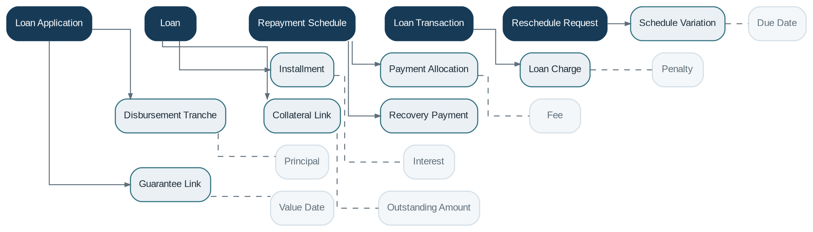

# Loan Management

> **Capability summary:** Manages the end-to-end lifecycle of a credit contract, from application and approval through disbursement, repayment, restructuring, delinquency, write-off, recovery, early settlement, and closure.

| Attribute | Value |
|---|---|
| Capability number | 05 |
| Category | Business Capability |
| Architectural layer | Business Layer |
| Primary record | Loan contract, schedule, transactions, and outstanding exposure |
| Criticality | Critical |

## Purpose and Scope

- Capture and assess loan applications and approved terms.
- Disburse funds in one or multiple tranches.
- Generate and maintain repayment schedules and installments.
- Record repayments, allocate amounts, assess charges, recalculate interest, restructure obligations, and close or write off exposure.

## Why It Matters

- Lending is usually the institution’s largest and most complex asset domain.
- Incorrect schedule, allocation, accrual, or reversal logic directly affects customers, income, risk, and financial statements.
- A contract-centric model preserves the legal and financial terms from which balances and obligations are derived.

## Domain Model

| **Aggregate or Core Concept** | **Responsibility**                                                                           |
|-------------------------------|----------------------------------------------------------------------------------------------|
| **Loan Application**          | Pre-contract request containing requested terms, applicant data, and decision history.       |
| **Loan**                      | Active credit contract and primary aggregate for balances, obligations, and lifecycle state. |
| **Repayment Schedule**        | Contractual sequence of installments and due components.                                     |
| **Loan Transaction**          | Immutable financial event such as disbursement, repayment, refund, waiver, or write-off.     |
| **Reschedule Request**        | Controlled proposal to amend future obligations or contractual terms.                        |

### Supporting Entities

- Disbursement Tranche
- Installment
- Payment Allocation
- Loan Charge
- Schedule Variation
- Guarantee Link
- Collateral Link
- Recovery Payment
- Loan Officer Assignment

### Value Objects and Policy Concepts

- Principal
- Interest
- Fee
- Penalty
- Due Date
- Value Date
- Outstanding Amount
- Days Past Due
- Repayment Frequency

## Lifecycle and Representative Workflows

> **Typical lifecycle:** Submitted → Approved → Disbursed → Active → Delinquent → Rescheduled or Re-aged → Written Off → Foreclosed or Early Settled → Closed

1. Origination: apply, validate eligibility, approve or reject, accept terms, and disburse.
2. Servicing: accrue interest, assess charges, accept repayments, allocate funds, and update the schedule.
3. Restructuring: propose, approve, and apply a new schedule while preserving the original contract and history.
4. Loss and recovery: write off qualifying exposure, record recoveries, and maintain accounting traceability.

## Relationships with Other Capabilities

| **Related capability**             | **Interaction**                                                           |
|------------------------------------|---------------------------------------------------------------------------|
| [**Customer Management**](../01-business-capabilities/01-customer-management.md)            | Identifies borrowers, co-borrowers, guarantors, and related parties.      |
| [**Product Catalog**](../01-business-capabilities/04-product-catalog.md)                | Provides contractual defaults and limits for origination.                 |
| **Interest Engine and Fee Engine** | Calculate time-based and event-based obligations.                         |
| [**Payment Processing**](../03-financial-infrastructure/10-payment-processing.md)             | Executes disbursement and repayment movements.                            |
| [**Delinquency Management**](../02-policy-capabilities/13-delinquency-management.md)         | Classifies arrears and supplies collection and provisioning context.      |
| [**Collateral Management**](../02-policy-capabilities/14-collateral-management.md)          | Maintains pledged security and loan-to-value metrics.                     |
| **Accounting and General Ledger**  | Record disbursement, accrual, repayment, write-off, and recovery effects. |
| [**Workflow & Approval**](../05-platform-capabilities/17-workflow-and-approval.md)            | Coordinates credit decisions, exceptions, restructures, and waivers.      |

## Distinctive Aspects and Peculiarities

- A loan is a contract, not merely a balance; schedules and transactions are derived representations of the agreement and events.
- Payment allocation order can materially change delinquency, income, and principal reduction and is often product-configurable.
- Backdated transactions may require schedule, accrual, delinquency, and accounting replay.
- Reversal should preserve the original transaction and create an explicit compensating history.
- Rescheduling, re-aging, refinancing, and early settlement are distinct operations with different legal and accounting consequences.
- Multiple disbursement loans require tranche-level limits and schedule behavior.

## Representative Commands and Business Events

### Commands

- Submit Application
- Approve Loan
- Disburse Loan
- Make Repayment
- Reverse Transaction
- Waive Charge
- Reschedule Loan
- Write Off Loan
- Record Recovery
- Foreclose Loan
- Close Loan

### Business Events

- Loan Submitted
- Loan Approved
- Loan Disbursed
- Repayment Posted
- Schedule Recalculated
- Loan Became Delinquent
- Loan Rescheduled
- Loan Written Off
- Recovery Received
- Loan Closed

## Key Invariants and Design Guardrails

- Principal outstanding cannot be negative except for explicitly supported credit-balance scenarios.
- Financial totals reconcile across transactions, schedule components, and accounting postings.
- Every schedule change is attributable to a valid contract rule or approved variation.
- A closed loan has no unresolved financial obligations, pending transactions, or active security holds.
- Reversed transactions remain visible and are never physically deleted.

> **Boundary:** Loan Management owns the credit contract and its operational subledger. It delegates generic interest, fees, payments, collateral, accounting, workflow, and reporting concerns to their respective capabilities.
