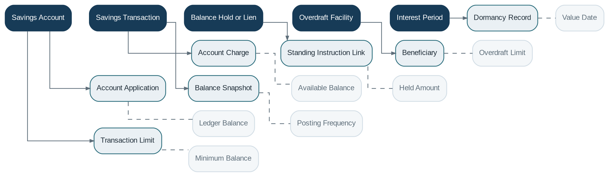

# Savings Management

> **Capability summary:** Manages open-ended transactional deposit accounts used for deposits, withdrawals, transfers, balance holding, interest, overdraft, liens, dormancy, and closure.

| Attribute | Value |
|---|---|
| Capability number | 06 |
| Category | Business Capability |
| Architectural layer | Business Layer |
| Primary record | Savings account, transactions, holds, and balances |
| Criticality | Critical |

## Purpose and Scope

- Open, approve, activate, block, make dormant, reactivate, and close savings or current accounts.
- Record deposits, withdrawals, transfers, reversals, fees, and interest postings.
- Maintain ledger, available, held, and overdraft balances.
- Enforce transaction limits, account restrictions, liens, and authorization rules.

## Why It Matters

- Savings accounts are a primary customer relationship and a major source of institutional funding.
- Balance correctness and immediate transaction consistency are essential for customer trust and payment safety.
- The capability provides the operational subledger for highly frequent, event-driven account activity.

## Domain Model

| **Aggregate or Core Concept** | **Responsibility**                                                                    |
|-------------------------------|---------------------------------------------------------------------------------------|
| **Savings Account**           | Open-ended deposit contract and primary balance-owning aggregate.                     |
| **Savings Transaction**       | Immutable deposit, withdrawal, transfer, fee, interest, or reversal event.            |
| **Balance Hold or Lien**      | Reservation that reduces available funds without necessarily changing ledger balance. |
| **Overdraft Facility**        | Authorized negative-balance limit and pricing terms.                                  |
| **Interest Period**           | Calculation and posting context for account interest.                                 |

### Supporting Entities

- Account Application
- Account Charge
- Standing Instruction Link
- Beneficiary
- Dormancy Record
- Transaction Limit
- Balance Snapshot

### Value Objects and Policy Concepts

- Ledger Balance
- Available Balance
- Held Amount
- Overdraft Limit
- Value Date
- Minimum Balance
- Posting Frequency

## Lifecycle and Representative Workflows

> **Typical lifecycle:** Submitted → Approved → Active → Restricted or Blocked → Dormant → Closed

1. Account opening: apply, approve, satisfy initial deposit requirements, and activate.
2. Transaction processing: validate status and available funds, post event, update balances, and account for the movement.
3. Dormancy: detect inactivity, restrict operations, and reactivate through an approved process.
4. Closure: settle charges and interest, release holds, transfer residual funds, and close.

## Relationships with Other Capabilities

| **Related capability**             | **Interaction**                                                         |
|------------------------------------|-------------------------------------------------------------------------|
| [**Customer Management**](../01-business-capabilities/01-customer-management.md)            | Identifies holders, joint holders, signatories, and beneficiaries.      |
| [**Product Catalog**](../01-business-capabilities/04-product-catalog.md)                | Supplies balance rules, interest, overdraft, fees, and limits.          |
| [**Payment Processing**](../03-financial-infrastructure/10-payment-processing.md)             | Executes transfers, cash movements, and external payments.              |
| **Interest Engine and Fee Engine** | Calculate interest, maintenance fees, overdraft pricing, and penalties. |
| **Accounting and General Ledger**  | Record deposit liabilities, cash movement, fees, and interest expense.  |
| [**Batch Processing**](../05-platform-capabilities/20-batch-processing.md)               | Runs interest posting, dormancy, charges, and statement cycles.         |
| **Notification and Reporting**     | Produce alerts, statements, and customer views.                         |

## Distinctive Aspects and Peculiarities

- Savings is event-driven rather than repayment-schedule-driven.
- Ledger balance, available balance, cleared balance, and value-dated balance may differ.
- Liens and holds should be modeled explicitly rather than hidden as artificial transactions.
- Overdraft converts a liability account into a temporary credit exposure and may trigger lending-like rules.
- Backdated and value-dated entries can require interest recalculation without changing transaction chronology.

## Representative Commands and Business Events

### Commands

- Open Account
- Activate Account
- Deposit Funds
- Withdraw Funds
- Place Hold
- Release Hold
- Post Interest
- Assess Charge
- Reverse Transaction
- Mark Dormant
- Close Account

### Business Events

- Savings Account Activated
- Deposit Posted
- Withdrawal Posted
- Hold Placed
- Interest Posted
- Account Became Dormant
- Transaction Reversed
- Account Closed

## Key Invariants and Design Guardrails

- Every posted transaction is immutable and traceable to its source.
- Available funds reflect all applicable holds, restrictions, and overdraft limits.
- An account cannot close with unresolved holds, pending settlements, or unprocessed obligations.
- Balance updates and accounting postings are transactionally consistent or recoverably coordinated.

> **Boundary:** Savings Management owns the account subledger and balance state. It does not own generic payment rails, product templates, or the institution’s General Ledger.
