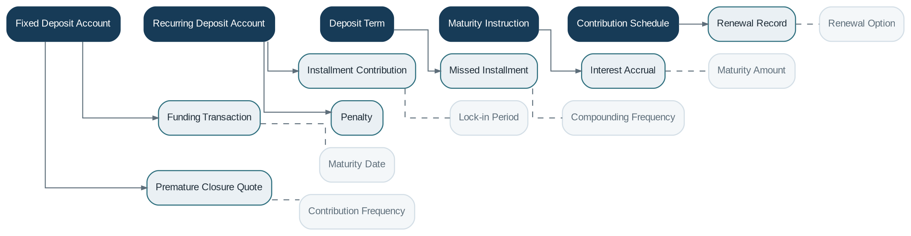

# Deposit Management

> **Capability summary:** Manages contractual term-deposit products, especially fixed deposits and recurring deposits, where funding, interest, installment obligations, lock-in periods, maturity, renewal, and premature closure are governed by a defined agreement.

| Attribute | Value |
|---|---|
| Capability number | 07 |
| Category | Business Capability |
| Architectural layer | Business Layer |
| Primary record | Term-deposit contract, contribution schedule, and maturity state |
| Criticality | High |

## Purpose and Scope

- Originate fixed and recurring deposit contracts.
- Record principal funding and recurring installment contributions.
- Calculate and post contractual interest.
- Process maturity instructions, renewal, withdrawal restrictions, penalties, and premature closure.

## Why It Matters

- Term deposits are an important funding instrument with predictable maturity and pricing.
- Contractual restrictions and early-termination rules differ fundamentally from open-ended savings accounts.
- Accurate maturity and renewal processing is essential for liquidity planning and customer commitments.

## Domain Model

| **Aggregate or Core Concept** | **Responsibility**                                                                      |
|-------------------------------|-----------------------------------------------------------------------------------------|
| **Fixed Deposit Account**     | Term contract funded by a principal amount and held to maturity.                        |
| **Recurring Deposit Account** | Term contract funded through scheduled periodic contributions.                          |
| **Deposit Term**              | Contractual duration, lock-in, rate, and maturity conditions.                           |
| **Maturity Instruction**      | Customer or product instruction for payout, transfer, partial renewal, or full renewal. |
| **Contribution Schedule**     | Required recurring installments and compliance status.                                  |

### Supporting Entities

- Funding Transaction
- Installment Contribution
- Missed Installment
- Interest Accrual
- Renewal Record
- Premature Closure Quote
- Penalty

### Value Objects and Policy Concepts

- Maturity Date
- Lock-in Period
- Compounding Frequency
- Maturity Amount
- Renewal Option
- Contribution Frequency

## Lifecycle and Representative Workflows

> **Typical lifecycle:** Submitted → Approved → Awaiting Funding → Active → Matured → Renewed → Prematurely Closed → Closed

1. Origination: choose product and term, approve, receive funding, and activate.
2. Recurring servicing: collect installments, identify missed contributions, assess consequences, and update maturity projections.
3. Maturity: calculate proceeds and execute payout or renewal instructions.
4. Premature closure: quote adjusted interest and penalties, approve, settle, and close.

## Relationships with Other Capabilities

| **Related capability**             | **Interaction**                                                            |
|------------------------------------|----------------------------------------------------------------------------|
| [**Customer Management**](../01-business-capabilities/01-customer-management.md)            | Identifies depositors, joint holders, nominees, and beneficiaries.         |
| [**Product Catalog**](../01-business-capabilities/04-product-catalog.md)                | Defines term options, rates, penalties, and maturity behavior.             |
| **Interest Engine and Fee Engine** | Calculate contractual returns and early-termination consequences.          |
| [**Payment Processing**](../03-financial-infrastructure/10-payment-processing.md)             | Moves initial funding, contributions, maturity proceeds, and refunds.      |
| [**Batch Processing**](../05-platform-capabilities/20-batch-processing.md)               | Runs accrual, maturity, renewal, and missed-installment detection.         |
| **Accounting and General Ledger**  | Record deposit liabilities and interest expense.                           |
| [**Notification**](../05-platform-capabilities/18-notification.md)                   | Sends contribution reminders, maturity notices, and renewal confirmations. |

## Distinctive Aspects and Peculiarities

- Fixed and recurring deposits are contract-oriented, not general transaction accounts.
- Maturity instructions may be captured at opening or changed under controlled conditions.
- Premature closure usually requires an effective-rate recomputation, not simply a fee deduction.
- Recurring deposits need installment compliance and arrears logic that resembles but is not identical to loan schedules.
- Automatic renewal must use a clearly identified product version and rate effective at renewal.

## Representative Commands and Business Events

### Commands

- Open Fixed Deposit
- Open Recurring Deposit
- Fund Deposit
- Record Contribution
- Post Interest
- Set Maturity Instruction
- Renew Deposit
- Quote Premature Closure
- Close Deposit

### Business Events

- Deposit Activated
- Contribution Received
- Installment Missed
- Interest Posted
- Deposit Matured
- Deposit Renewed
- Deposit Prematurely Closed

## Key Invariants and Design Guardrails

- Maturity value is reproducible from the contract, rate history, contributions, and adjustments.
- Funds cannot be withdrawn contrary to lock-in and authorization rules.
- Renewal creates a distinct contractual period with traceable terms.
- Closure settles all interest, penalties, taxes where applicable, and payout instructions.

> **Boundary:** Deposit Management owns term-deposit contracts. It should not be reduced to Savings Management because its lifecycle, liquidity, and maturity semantics are materially different.
