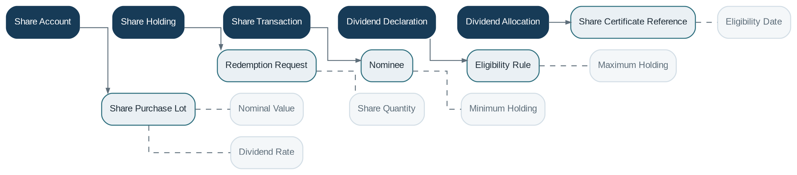

# Share Management

> **Capability summary:** Manages member or customer equity participation in cooperatives, credit unions, mutual institutions, and similar organizations through share applications, purchases, holdings, redemption, dividend allocation, and account closure.

| Attribute | Value |
|---|---|
| Capability number | 08 |
| Category | Business Capability |
| Architectural layer | Business Layer |
| Primary record | Share account, holdings, transactions, and dividend allocations |
| Criticality | High |

## Purpose and Scope

- Open and approve share accounts.
- Issue initial and additional shares subject to limits.
- Maintain share holdings and transaction history.
- Declare and allocate dividends and process redemption or closure.

## Why It Matters

- Shares represent ownership or membership capital rather than a repayable deposit liability.
- The capability supports governance, capital structure, membership requirements, and equitable dividend distribution.
- Separating shares from deposits avoids misleading balance, maturity, and return semantics.

## Domain Model

| **Aggregate or Core Concept** | **Responsibility**                                                             |
|-------------------------------|--------------------------------------------------------------------------------|
| **Share Account**             | Customer or member relationship to issued institutional shares.                |
| **Share Holding**             | Quantity and value of active shares, potentially organized into purchase lots. |
| **Share Transaction**         | Purchase, additional purchase, redemption, adjustment, or reversal.            |
| **Dividend Declaration**      | Approved distribution period, amount, eligibility, and calculation rule.       |
| **Dividend Allocation**       | Member-level entitlement and payment status.                                   |

### Supporting Entities

- Share Purchase Lot
- Redemption Request
- Nominee
- Eligibility Rule
- Share Certificate Reference

### Value Objects and Policy Concepts

- Nominal Value
- Share Quantity
- Minimum Holding
- Maximum Holding
- Eligibility Date
- Dividend Rate

## Lifecycle and Representative Workflows

> **Typical lifecycle:** Applied → Approved → Active → Partially Redeemed → Fully Redeemed → Closed

1. Membership onboarding: apply, approve, purchase minimum required shares, and activate.
2. Capital servicing: record additional purchases and maintain holdings.
3. Dividend cycle: declare, determine eligible holdings, allocate, pay or capitalize, and report.
4. Redemption: validate restrictions, approve, settle proceeds, and reduce holdings.

## Relationships with Other Capabilities

| **Related capability**            | **Interaction**                                                         |
|-----------------------------------|-------------------------------------------------------------------------|
| [**Customer Management**](../01-business-capabilities/01-customer-management.md)           | Identifies members, joint holders, and nominees.                        |
| [**Product Catalog**](../01-business-capabilities/04-product-catalog.md)               | Defines share classes, nominal value, limits, and dividend eligibility. |
| [**Payment Processing**](../03-financial-infrastructure/10-payment-processing.md)            | Collects purchases and pays redemptions or dividends.                   |
| **Accounting and General Ledger** | Record equity issuance, redemption, and distributions.                  |
| [**Workflow & Approval**](../05-platform-capabilities/17-workflow-and-approval.md)           | Coordinates dividend declaration and restricted redemptions.            |
| [**Reporting**](../04-information-capabilities/16-reporting.md)                     | Produces member registers, capital reports, and dividend statements.    |

## Distinctive Aspects and Peculiarities

- Shares are equity; they normally have no guaranteed return or fixed maturity.
- Purchase lots may matter when dividend eligibility or redemption restrictions depend on holding period.
- Minimum holdings may be a prerequisite for membership or access to other products.
- Redemption may be restricted by capital adequacy, notice periods, or institutional rules.
- Dividend declaration and allocation are separate decisions.

## Representative Commands and Business Events

### Commands

- Apply for Shares
- Approve Share Account
- Purchase Shares
- Redeem Shares
- Declare Dividend
- Allocate Dividend
- Pay Dividend
- Close Share Account

### Business Events

- Share Account Activated
- Shares Issued
- Shares Redeemed
- Dividend Declared
- Dividend Allocated
- Share Account Closed

## Key Invariants and Design Guardrails

- Issued quantity and financial value reconcile with share transactions and accounting.
- A holder cannot redeem more eligible shares than currently owned.
- Dividends are based on an approved declaration and a reproducible eligibility basis.
- Closure requires zero remaining holdings and no pending distributions.

> **Boundary:** Share Management owns equity holdings and distributions. It does not treat shares as savings balances or guarantee deposit-like repayment terms.
