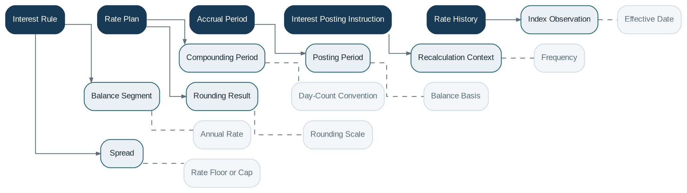

# Interest Engine

> **Capability summary:** Provides reusable, deterministic policies for calculating, accruing, capitalizing, posting, and recalculating interest across loans, savings, overdrafts, and term deposits.

| Attribute | Value |
|---|---|
| Capability number | 11 |
| Category | Policy Capability |
| Architectural layer | Policy Layer |
| Primary record | Interest rules, rate history, accrual calculations, and posting instructions |
| Criticality | High |

## Purpose and Scope

- Support flat, declining-balance, daily-balance, average-balance, simple, and compound methods.
- Apply fixed or floating rates with effective-dated history.
- Apply day-count, compounding, posting-frequency, rounding, and balance-basis rules.
- Produce accrual and posting results that product domains can consume and reproduce.

## Why It Matters

- Interest is time-dependent and financially sensitive; small inconsistencies compound across portfolios.
- A shared engine ensures consistent interpretation of rate, calendar, rounding, and day-count rules.
- Deterministic recalculation supports backdated transactions, dispute resolution, audit, and contract servicing.

## Domain Model

| **Aggregate or Core Concept**    | **Responsibility**                                                  |
|----------------------------------|---------------------------------------------------------------------|
| **Interest Rule**                | Calculation policy applied by a product or contract.                |
| **Rate Plan**                    | Fixed or floating rate definition with effective periods.           |
| **Accrual Period**               | Time window, balance basis, and calculated interest result.         |
| **Interest Posting Instruction** | Amount and target date to be applied by the owning contract domain. |
| **Rate History**                 | Immutable sequence of effective rate changes.                       |

### Supporting Entities

- Balance Segment
- Compounding Period
- Posting Period
- Recalculation Context
- Index Observation
- Spread
- Rounding Result

### Value Objects and Policy Concepts

- Annual Rate
- Day-Count Convention
- Balance Basis
- Frequency
- Effective Date
- Rate Floor or Cap
- Rounding Scale

## Lifecycle and Representative Workflows

> **Typical lifecycle:** Configured → Effective → Accruing → Capitalized or Posted → Recalculated → Superseded

1. Accrual: segment the time period by balance and rate changes, calculate daily or periodic amounts, and aggregate.
2. Posting: convert accrued interest into a contract transaction and related accounting event.
3. Recalculation: replay affected periods after backdated activity or approved contractual changes.

## Relationships with Other Capabilities

| **Related capability**             | **Interaction**                                                  |
|------------------------------------|------------------------------------------------------------------|
| [**Product Catalog**](../01-business-capabilities/04-product-catalog.md)                | Selects interest methods and parameters for products.            |
| [**Loan Management**](../01-business-capabilities/05-loan-management.md)                | Uses the engine for scheduled and accrued lending interest.      |
| **Savings and Deposit Management** | Use the engine for payable interest and overdraft interest.      |
| [**Accounting**](../03-financial-infrastructure/09-accounting.md)                     | Recognizes accrued and posted interest.                          |
| [**Batch Processing**](../05-platform-capabilities/20-batch-processing.md)               | Runs periodic accrual and posting jobs.                          |
| [**Configuration**](../05-platform-capabilities/21-configuration.md)                  | Provides calendars, precision, and institution-wide conventions. |
| **Reporting and Audit**            | Require reproducible calculation detail.                         |

## Distinctive Aspects and Peculiarities

- Day-count, value date, posting date, and business date must be explicit.
- Rate history cannot be overwritten without destroying reproducibility.
- Rounding may occur at daily, installment, period, or posting level and produces materially different totals.
- Floating-rate calculation needs index observation date, fallback behavior, spread, cap, and floor.
- The engine calculates amounts but does not post transactions directly into product aggregates.

## Representative Commands and Business Events

### Commands

- Define Rate Plan
- Calculate Interest
- Accrue Interest
- Recalculate Period
- Generate Posting Instruction
- Supersede Rate

### Business Events

- Interest Calculated
- Interest Accrued
- Interest Recalculated
- Interest Posting Requested
- Rate Became Effective

## Key Invariants and Design Guardrails

- Identical inputs and histories produce identical outputs.
- Every result identifies the rule version, rate observations, dates, and rounding path used.
- Rate periods do not overlap ambiguously within the same plan.
- Calculated interest is not treated as posted until the owning domain records the transaction.

> **Boundary:** Interest Engine owns reusable calculation policy and evidence. Product domains own contractual application, transaction posting, and customer balances.
