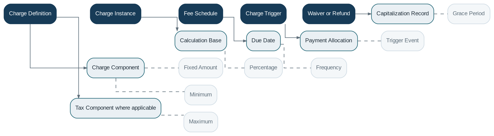

# Fee Engine

> **Capability summary:** Defines and evaluates reusable fees, charges, commissions, and penalties, including amount calculation, triggering, scheduling, assessment, waiver, refund, capitalization, and payment status.

| Attribute | Value |
|---|---|
| Capability number | 12 |
| Category | Policy Capability |
| Architectural layer | Policy Layer |
| Primary record | Charge definitions, assessments, schedules, and adjustments |
| Criticality | High |

## Purpose and Scope

- Define fixed, percentage, installment, recurring, one-time, and overdue charges.
- Trigger charges from events, schedules, balances, or delinquency conditions.
- Maintain assessed, due, paid, waived, refunded, capitalized, and reversed amounts.
- Provide charge outcomes to product domains and accounting.

## Why It Matters

- Fees are a major source of revenue and a frequent source of customer disputes and regulatory scrutiny.
- A shared engine prevents duplicated and inconsistent charge logic across products.
- Explicit assessment and lifecycle records support disclosure, waiver approval, refund, and audit.

## Domain Model

| **Aggregate or Core Concept** | **Responsibility**                                         |
|-------------------------------|------------------------------------------------------------|
| **Charge Definition**         | Reusable fee or penalty policy and calculation basis.      |
| **Charge Instance**           | Contract-specific assessed obligation and lifecycle state. |
| **Fee Schedule**              | Recurring or date-based assessment plan.                   |
| **Charge Trigger**            | Event or condition that creates an assessment.             |
| **Waiver or Refund**          | Authorized adjustment with reason and financial treatment. |

### Supporting Entities

- Charge Component
- Calculation Base
- Due Date
- Payment Allocation
- Capitalization Record
- Tax Component where applicable

### Value Objects and Policy Concepts

- Fixed Amount
- Percentage
- Frequency
- Trigger Event
- Grace Period
- Maximum
- Minimum
- Waiver Reason

## Lifecycle and Representative Workflows

> **Typical lifecycle:** Defined → Assessed → Due → Partially Paid → Paid → Waived → Refunded → Capitalized → Reversed

1. Assessment: detect trigger, resolve effective definition, calculate amount, and create a charge instance.
2. Collection: allocate payments to due charges according to product rules.
3. Adjustment: waive, refund, capitalize, or reverse through authorized, auditable operations.

## Relationships with Other Capabilities

| **Related capability**                          | **Interaction**                                                           |
|-------------------------------------------------|---------------------------------------------------------------------------|
| [**Product Catalog**](../01-business-capabilities/04-product-catalog.md)                             | Associates charge definitions with products and lifecycle events.         |
| **Loan / Savings / Deposit / Share Management** | Own contract-specific charge instances and apply outcomes.                |
| [**Delinquency Management**](../02-policy-capabilities/13-delinquency-management.md)                      | May trigger penalties from arrears status.                                |
| [**Payment Processing**](../03-financial-infrastructure/10-payment-processing.md)                          | Collects or refunds assessed amounts.                                     |
| [**Accounting**](../03-financial-infrastructure/09-accounting.md)                                  | Recognizes fee income, receivables, waivers, refunds, and capitalization. |
| [**Workflow & Approval**](../05-platform-capabilities/17-workflow-and-approval.md)                         | Authorizes exceptional waivers, refunds, and overrides.                   |
| [**Notification**](../05-platform-capabilities/18-notification.md)                                | Communicates assessments and due dates.                                   |

## Distinctive Aspects and Peculiarities

- Interest and fees should remain separate even when both are percentage-based.
- Assessment date, due date, payment date, and accounting recognition date may differ.
- Percentage fees require an explicit base amount and timing rule.
- Capitalizing a fee changes principal and may affect interest and disclosure.
- Waiver, refund, reversal, and write-off are not interchangeable.

## Representative Commands and Business Events

### Commands

- Define Charge
- Assess Charge
- Schedule Charge
- Pay Charge
- Waive Charge
- Refund Charge
- Capitalize Charge
- Reverse Charge

### Business Events

- Charge Assessed
- Charge Became Due
- Charge Paid
- Charge Waived
- Charge Refunded
- Charge Capitalized
- Charge Reversed

## Key Invariants and Design Guardrails

- Every assessment references an effective charge definition and reproducible calculation base.
- Collected, outstanding, waived, and refunded components reconcile to the assessed amount.
- Unauthorized users cannot waive or refund charges.
- A reversed charge remains in history and cannot continue to collect.

> **Boundary:** Fee Engine owns reusable charge policy and calculation. Contract domains own the resulting obligations and their effect on balances and lifecycle.
