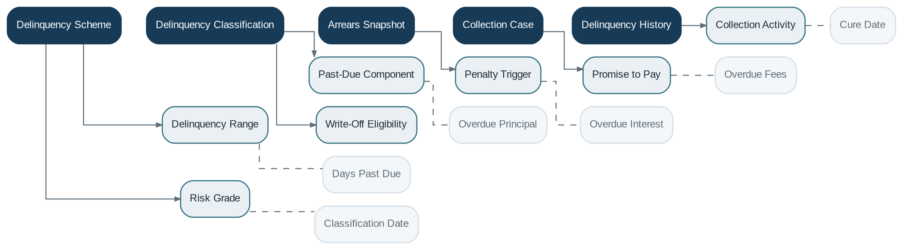

# Delinquency Management

> **Capability summary:** Determines and records arrears status, days past due, past-due amounts, delinquency buckets, cure, risk classification, collection context, write-off eligibility, and provisioning support for contracts with unpaid obligations.

| Attribute | Value |
|---|---|
| Capability number | 13 |
| Category | Policy Capability |
| Architectural layer | Policy Layer |
| Primary record | Delinquency schemes, classifications, arrears snapshots, and collection context |
| Criticality | High |

## Purpose and Scope

- Define delinquency ranges, buckets, and classification schemes.
- Calculate days past due and overdue components.
- Maintain current and historical classification.
- Supply triggers and context for collections, penalties, provisioning, reporting, and write-off decisions.

## Why It Matters

- Delinquency is the operational bridge between contractual non-payment and credit-risk action.
- Consistent classification is essential for collections prioritization, impairment, provisioning, and regulatory reporting.
- Historical status reveals customer behavior and portfolio migration, not just current arrears.

## Domain Model

| **Aggregate or Core Concept**  | **Responsibility**                                              |
|--------------------------------|-----------------------------------------------------------------|
| **Delinquency Scheme**         | Ordered ranges and business rules used to classify exposure.    |
| **Delinquency Classification** | Contract-level current bucket, start date, and basis.           |
| **Arrears Snapshot**           | Past-due components and days-past-due result for an as-of date. |
| **Collection Case**            | Operational recovery context linked to a delinquent contract.   |
| **Delinquency History**        | Immutable sequence of classifications and cures.                |

### Supporting Entities

- Delinquency Range
- Past-Due Component
- Penalty Trigger
- Promise to Pay
- Collection Activity
- Risk Grade
- Write-Off Eligibility

### Value Objects and Policy Concepts

- Days Past Due
- Overdue Principal
- Overdue Interest
- Overdue Fees
- Cure Date
- Classification Date

## Lifecycle and Representative Workflows

> **Typical lifecycle:** Current → Early Arrears → Intermediate Arrears → Severe Arrears → Collections → Cured → Written Off

1. Daily classification: identify unpaid due obligations, calculate DPD and past-due amount, resolve bucket, and record changes.
2. Cure: recognize settlement or approved restructuring and return the contract to current or revised status.
3. Escalation: trigger collection tasks, penalties, provisioning, or write-off review according to policy.

## Relationships with Other Capabilities

| **Related capability**  | **Interaction**                                                                      |
|-------------------------|--------------------------------------------------------------------------------------|
| [**Loan Management**](../01-business-capabilities/05-loan-management.md)     | Provides contractual due amounts, repayments, schedule changes, and write-off state. |
| [**Fee Engine**](../02-policy-capabilities/12-fee-engine.md)          | May assess overdue penalties from classification changes.                            |
| [**Workflow & Approval**](../05-platform-capabilities/17-workflow-and-approval.md) | Coordinates collection actions, exceptions, restructures, and write-off decisions.   |
| [**Accounting**](../03-financial-infrastructure/09-accounting.md)          | Uses classification for provisioning and impairment entries.                         |
| [**Reporting**](../04-information-capabilities/16-reporting.md)           | Produces arrears, migration, vintage, cure, and recovery analytics.                  |
| [**Batch Processing**](../05-platform-capabilities/20-batch-processing.md)    | Runs periodic classification and portfolio updates.                                  |
| [**Notification**](../05-platform-capabilities/18-notification.md)        | Sends reminders and arrears communications subject to policy.                        |

## Distinctive Aspects and Peculiarities

- DPD depends on the oldest unpaid contractual due date and institution-specific cure rules.
- Re-aging or rescheduling can alter future obligations but must not erase historical delinquency.
- Current classification and delinquency history are separate records.
- Collection activity is operational; it should not mutate contract balances except through authorized domain transactions.
- Write-off eligibility is a policy result, while actual write-off is a loan and accounting operation.

## Representative Commands and Business Events

### Commands

- Define Scheme
- Classify Contract
- Open Collection Case
- Record Collection Activity
- Record Promise to Pay
- Mark Cured
- Assess Write-Off Eligibility

### Business Events

- Contract Entered Delinquency
- Delinquency Bucket Changed
- Collection Case Opened
- Promise to Pay Broken
- Contract Cured
- Write-Off Eligible

## Key Invariants and Design Guardrails

- Classification is reproducible for an as-of date using contractual obligations and payment history.
- Delinquency history is not rewritten by later cure or restructure.
- Bucket ranges are ordered, non-overlapping, and effective-dated.
- Only the contract domain may change financial obligations.

> **Boundary:** Delinquency Management owns classification and recovery context. It does not own loan schedules, payments, accounting balances, or the final write-off transaction.
