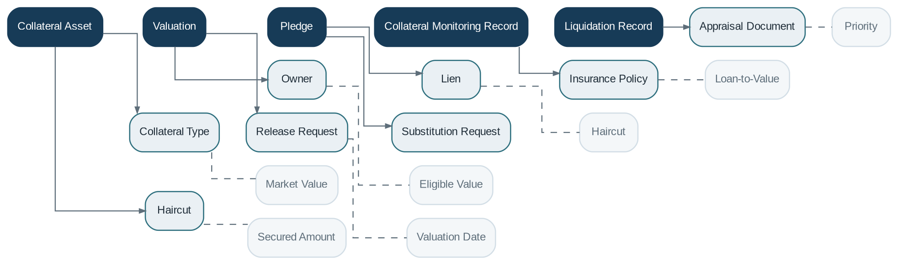

# Collateral Management

> **Capability summary:** Manages assets pledged to secure credit exposure, including collateral types, ownership, eligibility, valuation, pledges, insurance, monitoring, substitution, release, and liquidation.

| Attribute | Value |
|---|---|
| Capability number | 14 |
| Category | Policy Capability |
| Architectural layer | Policy Layer |
| Primary record | Collateral assets, valuations, pledges, and coverage history |
| Criticality | High |

## Purpose and Scope

- Register collateral assets and ownership evidence.
- Record independent valuations and valuation history.
- Assign collateral to one or more secured obligations.
- Monitor loan-to-value, legal perfection, insurance, expiry, substitution, release, and liquidation.

## Why It Matters

- Collateral reduces loss severity but introduces legal, valuation, operational, and concentration risk.
- Independent asset ownership allows one asset to secure multiple facilities and one facility to use multiple assets.
- Valuation history and pledge priority are essential for accurate risk and recovery decisions.

## Domain Model

| **Aggregate or Core Concept**    | **Responsibility**                                                                                   |
|----------------------------------|------------------------------------------------------------------------------------------------------|
| **Collateral Asset**             | Independent asset record with type, ownership, identifiers, and lifecycle.                           |
| **Valuation**                    | Effective-dated appraisal and eligible value.                                                        |
| **Pledge**                       | Legal or operational assignment of collateral to an exposure, including priority and secured amount. |
| **Collateral Monitoring Record** | Insurance, document, inspection, or expiry status.                                                   |
| **Liquidation Record**           | Recovery action and proceeds from disposal or enforcement.                                           |

### Supporting Entities

- Collateral Type
- Owner
- Lien
- Insurance Policy
- Appraisal Document
- Haircut
- Release Request
- Substitution Request

### Value Objects and Policy Concepts

- Market Value
- Eligible Value
- Haircut
- Loan-to-Value
- Priority
- Secured Amount
- Valuation Date

## Lifecycle and Representative Workflows

> **Typical lifecycle:** Registered → Eligible → Pledged → Monitored and Revalued → Released → Substituted → Enforced or Liquidated → Retired

1. Registration: capture asset, owner, evidence, type-specific attributes, and initial valuation.
2. Pledge: validate eligibility and available secured value, then assign to one or more loans.
3. Monitoring: revalue, track insurance and legal documents, and recalculate LTV.
4. Release or liquidation: authorize, update pledge state, and record financial recovery.

## Relationships with Other Capabilities

| **Related capability**                       | **Interaction**                                                             |
|----------------------------------------------|-----------------------------------------------------------------------------|
| [**Customer Management**](../01-business-capabilities/01-customer-management.md)                      | Identifies owners, borrowers, and related parties.                          |
| [**Loan Management**](../01-business-capabilities/05-loan-management.md)                          | References collateral pledges and secured exposure.                         |
| [**Product Catalog**](../01-business-capabilities/04-product-catalog.md)                          | Defines eligible collateral types and LTV policies.                         |
| [**Workflow & Approval**](../05-platform-capabilities/17-workflow-and-approval.md)                      | Coordinates valuation approval, substitution, release, and enforcement.     |
| [**Accounting**](../03-financial-infrastructure/09-accounting.md)                               | Records liquidation proceeds and impairment effects.                        |
| [**Reporting**](../04-information-capabilities/16-reporting.md)                                | Produces collateral coverage, concentration, expiry, and valuation reports. |
| **Document Management in Platform Services** | Stores appraisals, titles, insurance, and legal evidence.                   |

## Distinctive Aspects and Peculiarities

- Collateral should be an independent aggregate rather than embedded only inside a loan.
- Market value, forced-sale value, eligible value, and secured value are distinct concepts.
- Legal perfection and pledge priority can matter more than nominal valuation.
- One asset may be over-pledged if available secured value is not controlled.
- Release requires both financial satisfaction and legal or operational authorization.

## Representative Commands and Business Events

### Commands

- Register Collateral
- Record Valuation
- Pledge Collateral
- Revalue Collateral
- Substitute Collateral
- Release Collateral
- Record Insurance
- Liquidate Collateral

### Business Events

- Collateral Registered
- Valuation Recorded
- Collateral Pledged
- LTV Threshold Breached
- Collateral Released
- Collateral Substituted
- Collateral Liquidated

## Key Invariants and Design Guardrails

- Active pledges do not exceed eligible secured value under the defined priority rules.
- Valuations are effective-dated and never silently overwritten.
- Release cannot occur while protected obligations remain unless an approved exception exists.
- Every pledge identifies the secured exposure, amount or coverage rule, and priority.

> **Boundary:** Collateral Management owns assets, valuations, and pledges. Loan Management owns the secured contract and outstanding exposure.
