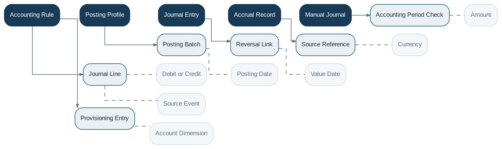

# Accounting

> **Capability summary:** Translates business events into balanced, traceable accounting entries using configurable posting rules and product mappings. It is the accounting interpretation layer between operational subledgers and the General Ledger.

| Attribute | Value |
|---|---|
| Capability number | 09 |
| Category | Financial Infrastructure |
| Architectural layer | Financial Infrastructure |
| Primary record | Accounting rules, journals, accruals, and source lineage |
| Criticality | Critical |

## Purpose and Scope

- Define accounting rules and product posting profiles.
- Generate accrual, cash, provisioning, fee, interest, payment, and adjustment entries.
- Validate double-entry balance and posting eligibility.
- Support manual journals, reversals, correction, and period controls.

## Why It Matters

- Every financial business event must have a consistent accounting interpretation.
- Centralized rules prevent each product domain from implementing incompatible debit and credit logic.
- Traceable journal generation is essential for reconciliation, audit, and financial statements.

## Domain Model

| **Aggregate or Core Concept** | **Responsibility**                                                           |
|-------------------------------|------------------------------------------------------------------------------|
| **Accounting Rule**           | Mapping from a business event and context to debit and credit journal lines. |
| **Posting Profile**           | Product or operation-specific collection of accounting mappings.             |
| **Journal Entry**             | Balanced accounting document containing one or more lines.                   |
| **Accrual Record**            | Time-based recognition item awaiting or supporting posting.                  |
| **Manual Journal**            | Authorized non-automated accounting adjustment.                              |

### Supporting Entities

- Journal Line
- Posting Batch
- Reversal Link
- Source Reference
- Accounting Period Check
- Provisioning Entry

### Value Objects and Policy Concepts

- Debit or Credit
- Posting Date
- Value Date
- Currency
- Amount
- Account Dimension
- Source Event

## Lifecycle and Representative Workflows

> **Typical lifecycle:** Business Event Received → Rule Resolved → Entry Generated → Validated → Posted → Reversed

1. Automated posting: consume a committed business event, resolve the effective rule, generate a balanced journal, and post.
2. Accrual processing: calculate earned or incurred amounts, create accrual records, and recognize them in the appropriate period.
3. Correction: reverse the erroneous entry and issue a corrected entry rather than mutating history.

## Relationships with Other Capabilities

| **Related capability**                          | **Interaction**                                                 |
|-------------------------------------------------|-----------------------------------------------------------------|
| [**Product Catalog**](../01-business-capabilities/04-product-catalog.md)                             | Defines product accounting mappings and posting profiles.       |
| **Loan / Savings / Deposit / Share Management** | Publish financial events and maintain operational subledgers.   |
| [**Payment Processing**](../03-financial-infrastructure/10-payment-processing.md)                          | Publishes cash and settlement events.                           |
| **Fee and Interest Engines**                    | Provide calculated financial components.                        |
| [**General Ledger**](../03-financial-infrastructure/15-general-ledger.md)                              | Receives validated journals and maintains ledger balances.      |
| [**Batch Processing**](../05-platform-capabilities/20-batch-processing.md)                            | Runs accrual, provisioning, aggregation, and scheduled posting. |
| **Audit and Reporting**                         | Trace source-to-entry lineage and produce accounting reports.   |

## Distinctive Aspects and Peculiarities

- Accounting and General Ledger are related but distinct: Accounting decides the entries; the GL stores and summarizes them.
- Double-entry balance must hold by journal, currency, and relevant ledger constraints.
- Posting rules must be effective-dated and reproducible for historical events.
- Manual journals need stricter permissions, evidence, and approval than automated postings.
- Idempotency prevents duplicate journals when events are retried.

## Representative Commands and Business Events

### Commands

- Define Accounting Rule
- Generate Journal
- Post Journal
- Create Manual Journal
- Reverse Journal
- Run Accrual
- Generate Provisioning Entries
- Close Accounting Period

### Business Events

- Journal Generated
- Journal Posted
- Journal Reversed
- Accrual Recognized
- Provisioning Posted
- Accounting Period Closed

## Key Invariants and Design Guardrails

- Every posted journal is balanced and references a valid GL account set.
- Automated postings retain source event and business transaction identifiers.
- Posted entries are not edited; corrections use reversal and replacement.
- No posting is accepted into a closed period without an authorized reopening or adjustment process.

> **Boundary:** Accounting owns posting logic and journal creation. It does not own customer contracts, payment execution, or the ledger account hierarchy.
