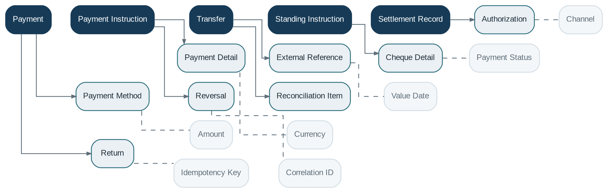

# Payment Processing

> **Capability summary:** Orchestrates and tracks movements of money across internal accounts, cash points, clearing networks, payment gateways, card processors, payment schemes, and external financial institutions. It manages payment instruction state, routing, authorization, execution, scheme exchange, settlement, exception handling, reversal, and external references.

| Attribute | Value |
|---|---|
| Capability number | 10 |
| Category | Financial Infrastructure |
| Architectural layer | Financial Infrastructure |
| Primary record | Payment instruction, orchestration state, scheme exchange, settlement, reconciliation, and external trace |
| Criticality | Critical |

## Purpose and Scope

- Capture payment instructions and payment method details.
- Validate, enrich, route, authorize, execute, submit, settle, reject, return, recall, repair, or reverse payments.
- Support cash, cheque, internal transfer, bank transfer, standing instruction, direct debit, bulk payment, gateway-based, card-originated, and scheme-based payments.
- Manage payment orchestration across channels, payment schemes, processors, clearing providers, settlement accounts, and exception queues.
- Provide scheme connectivity, message correlation, settlement integration, liquidity hooks, status tracking, idempotency, and reconciliation information.

## Why It Matters

- Payments are the operational mechanism by which financial obligations and customer instructions become movement of value.
- Separation from account domains allows consistent control across loans, savings, fees, cards, and external rails.
- Explicit settlement state is essential because authorization, execution, clearing, and finality may occur at different times.
- Scheme routing, exception handling, sanctions/AML hooks, liquidity checks, and settlement reconciliation materially affect operational risk and customer outcomes.

## Domain Model

| **Aggregate or Core Concept** | **Responsibility** |
|---|---|
| **Payment** | End-to-end payment lifecycle and current processing state. |
| **Payment Instruction** | Payer, payee, amount, currency, purpose, timing, and routing request. |
| **Payment Orchestration** | Route selection, validation sequence, provider handoff, retry, repair, and exception state. |
| **Transfer** | Linked debit and credit legs for an internal or external movement. |
| **Scheme Exchange** | Outbound and inbound scheme messages, acknowledgements, returns, recalls, and status reports. |
| **Standing Instruction** | Recurring future payment instruction. |
| **Settlement Record** | External or internal evidence of clearing and final settlement. |
| **Reconciliation Case** | Matching, investigation, adjustment, and closure of settlement or provider discrepancies. |

### Supporting Entities

- Payment Method
- Payment Detail
- External Reference
- Cheque Detail
- Authorization
- Route Decision
- Scheme Message
- Direct Debit Mandate
- Bulk Payment Batch
- Exception Case
- Repair Instruction
- Return
- Recall
- Reversal
- Reconciliation Item
- Settlement Account Reference
- Liquidity Check

### Value Objects and Policy Concepts

- Amount
- Currency
- Value Date
- Payment Status
- Channel
- Payment Scheme
- Clearing Status
- Idempotency Key
- Correlation ID
- Settlement Date
- Route
- Repair Reason
- Finality

## Lifecycle and Representative Workflows

> **Typical lifecycle:** Initiated -> Validated -> Routed -> Authorized -> Submitted or Executed -> Clearing -> Settled -> Reconciled -> Rejected, Returned, Recalled, Repaired, or Reversed

1. Internal transfer: reserve or validate funds, debit source, credit destination, account for both legs, and complete atomically.
2. External payment: validate scheme rules, select route, run screening and liquidity hooks, submit to rail, track acknowledgements and settlement, reconcile, and handle return, recall, repair, or rejection.
3. Direct debit: maintain mandate reference, initiate collection, handle acceptance, rejection, return, refund, and revocation state.
4. Bulk payment: validate batch and item-level instructions, submit through the selected scheme or provider, and reconcile mixed outcomes.
5. Standing instruction: identify due instructions, validate current conditions, execute, and record next run.

## Relationships with Other Capabilities

| **Related capability** | **Interaction** |
|---|---|
| [**Savings Management**](../01-business-capabilities/06-savings-management.md) | Provides source and destination account state and balances. |
| **Loan, Deposit, Share, and Card Management** | Receive repayments, disbursements, contributions, maturity proceeds, card-originated movements, and issuer settlement context. |
| [**Limits and Exposure Management**](../02-policy-capabilities/26-limits-and-exposure-management.md) | Supplies limit, overdraft, exposure, and authorization constraints where payment movement consumes availability. |
| **Accounting and General Ledger** | Record cash, settlement, suspense, and transfer entries. |
| [**Integration**](../05-platform-capabilities/19-integration.md) | Connects payment gateways, switches, clearing systems, banks, processors, fraud services, and scheme endpoints. |
| [**Batch Processing**](../05-platform-capabilities/20-batch-processing.md) | Executes standing instructions, bulk files, settlement cycles, and reconciliation. |
| [**Notification**](../05-platform-capabilities/18-notification.md) | Communicates payment status and exceptions. |
| [**Audit**](../05-platform-capabilities/23-audit.md) | Maintains end-to-end transaction trace. |

## Distinctive Aspects and Peculiarities

- Authorization, clearing, settlement, and reconciliation are distinct states and should not be represented by a single completed flag.
- Idempotency keys are mandatory for retried channel requests and asynchronous messages.
- Internal transfers should preserve atomic debit-credit semantics even when implemented through distributed components.
- Reversals, returns, refunds, recalls, repairs, and chargebacks have different meanings and accounting.
- External references are not always unique globally and require provider, processor, or scheme scope.
- Route selection should preserve the reason, rule set, provider, scheme, and fallback behavior used for the payment.
- Payment repair changes operational instructions but must not obscure the original customer instruction.
- Liquidity, sanctions, AML, and fraud checks may block or hold execution without transferring ownership of the payment lifecycle.
- Scheme cut-offs, calendars, finality rules, and return windows are part of payment behavior and must be represented explicitly.

## Representative Commands and Business Events

### Commands

- Initiate Payment
- Validate Payment
- Route Payment
- Authorize Payment
- Execute Transfer
- Submit to Clearing
- Record Settlement
- Reconcile Settlement
- Repair Payment
- Recall Payment
- Return Payment
- Reverse Payment
- Register Direct Debit Mandate
- Execute Bulk Payment
- Create Standing Instruction

### Business Events

- Payment Initiated
- Payment Validated
- Payment Routed
- Payment Authorized
- Payment Executed
- Payment Submitted to Scheme
- Payment Settled
- Payment Reconciled
- Payment Rejected
- Payment Repaired
- Payment Recalled
- Payment Returned
- Payment Reversed
- Direct Debit Mandate Registered
- Bulk Payment Executed

## Key Invariants and Design Guardrails

- A payment amount and currency remain stable after authorization unless a controlled amendment is supported.
- Duplicate instructions with the same idempotency scope do not move funds twice.
- Source and destination legs reconcile to the payment amount and fees.
- Settled payments retain immutable external and accounting references.
- Scheme acknowledgements, returns, recalls, repairs, and settlement reports remain correlated to the original payment instruction.
- A payment cannot be marked finally settled until the applicable scheme, provider, or internal settlement evidence supports finality.
- Reconciled payment outcomes preserve item-level status for bulk and batched payments.

> **Boundary:** Payment Processing owns payment lifecycle, orchestration, scheme exchange, exception handling, settlement coordination, and reconciliation state. It does not own customer account balances, card instrument lifecycle, product rules, customer due diligence, treasury funding decisions, or the General Ledger.

