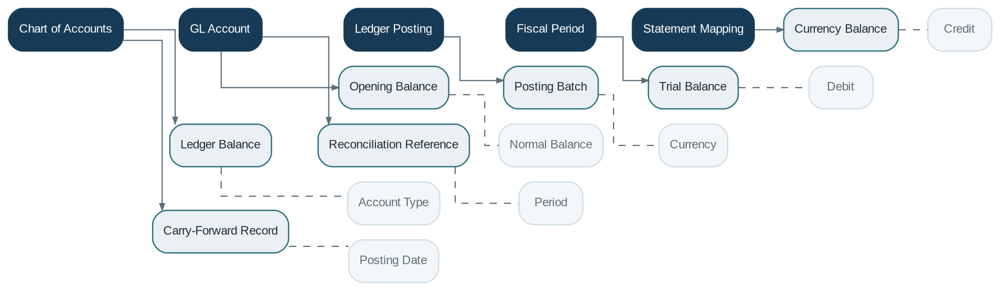

# General Ledger

> **Capability summary:** Maintains the institution’s formal books of account: chart of accounts, GL accounts, posted journal lines, balances, periods, carry-forward, multi-currency views, and financial-statement mappings.

| Attribute | Value |
|---|---|
| Capability number | 15 |
| Category | Financial Infrastructure |
| Architectural layer | Financial Infrastructure |
| Primary record | Chart of accounts, posted ledger lines, balances, and fiscal periods |
| Criticality | Critical |

## Purpose and Scope

- Define and govern the chart of accounts.
- Post validated journal entries and maintain account balances.
- Open, close, and control fiscal periods.
- Produce trial balances and map accounts to financial statements.

## Why It Matters

- The General Ledger is the financial system of record used to prove that the institution’s books balance.
- It provides the authoritative basis for financial statements, statutory reporting, reconciliation, and audit.
- A product-agnostic ledger isolates financial truth from operational product implementation.

## Domain Model

| **Aggregate or Core Concept** | **Responsibility**                                                         |
|-------------------------------|----------------------------------------------------------------------------|
| **Chart of Accounts**         | Hierarchical account structure and classification model.                   |
| **GL Account**                | Individual asset, liability, equity, income, or expense account.           |
| **Ledger Posting**            | Posted debit or credit line with source and period context.                |
| **Fiscal Period**             | Open or closed accounting interval.                                        |
| **Statement Mapping**         | Relationship from GL accounts to reporting lines and financial statements. |

### Supporting Entities

- Ledger Balance
- Opening Balance
- Posting Batch
- Trial Balance
- Currency Balance
- Carry-Forward Record
- Reconciliation Reference

### Value Objects and Policy Concepts

- Account Type
- Normal Balance
- Currency
- Debit
- Credit
- Posting Date
- Period
- Dimension

## Lifecycle and Representative Workflows

> **Typical lifecycle:** Defined → Active → Blocked for Posting → Inactive

1. Journal posting: validate period and account eligibility, post all lines, and update balances atomically.
2. Period close: complete reconciliations, prevent ordinary postings, produce trial balance, and lock the period.
3. Year-end: close income and expense accounts and carry permitted balances forward.

## Relationships with Other Capabilities

| **Related capability**    | **Interaction**                                                                       |
|---------------------------|---------------------------------------------------------------------------------------|
| [**Accounting**](../03-financial-infrastructure/09-accounting.md)            | Generates balanced journals and posting instructions.                                 |
| **All Financial Domains** | Provide source events through Accounting rather than posting directly where possible. |
| [**Reporting**](../04-information-capabilities/16-reporting.md)             | Builds financial statements and management reports from GL data.                      |
| [**Administration**](../05-platform-capabilities/22-administration.md)        | Controls period operations and privileged ledger maintenance.                         |
| [**Audit**](../05-platform-capabilities/23-audit.md)                 | Traces every posting to source, actor, rule, and reversal.                            |
| [**Integration**](../05-platform-capabilities/19-integration.md)           | Exports ledger data to consolidation, treasury, tax, or enterprise finance systems.   |

## Distinctive Aspects and Peculiarities

- The GL should know accounts and postings, not loans, savings products, or customer contract semantics.
- Account hierarchy and statement mappings evolve, but historical reporting must remain reproducible.
- Multi-currency ledgers may maintain transaction currency, functional currency, and reporting currency.
- Suspense and clearing accounts require active reconciliation and aging controls.
- Trial balance equality is necessary but not sufficient for accounting correctness.

## Representative Commands and Business Events

### Commands

- Create GL Account
- Activate GL Account
- Post Journal
- Block Account
- Open Period
- Close Period
- Carry Forward Balance
- Map Statement Line

### Business Events

- GL Account Activated
- Journal Posted to GL
- Period Closed
- Balance Carried Forward
- Statement Mapping Changed

## Key Invariants and Design Guardrails

- Total posted debits equal total posted credits for every balanced journal and required currency scope.
- Closed periods reject ordinary postings.
- Posted ledger lines are immutable and traceable to source journals.
- Account classification and normal-balance rules remain internally consistent.

> **Boundary:** General Ledger owns accounts, postings, balances, and periods. Accounting owns the interpretation and construction of journals.
