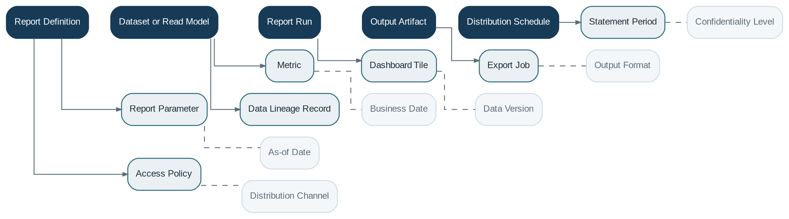

# Reporting

> **Capability summary:** Transforms operational, financial, risk, and reference data into statements, dashboards, regulatory reports, portfolio analysis, scheduled outputs, ad hoc queries, and controlled exports.

| Attribute | Value |
|---|---|
| Capability number | 16 |
| Category | Information Capability |
| Architectural layer | Information Layer |
| Primary record | Report definitions, governed datasets, runs, and output artifacts |
| Criticality | High |

## Purpose and Scope

- Define operational, financial, regulatory, portfolio, delinquency, audit, and customer reports.
- Provide parameters, access rules, schedules, output formats, and distribution.
- Generate customer and loan statements.
- Expose metrics and exports without placing analytical load or logic inside transaction processing.

## Why It Matters

- Reporting turns system activity into management insight, customer communication, regulatory evidence, and financial disclosure.
- Reproducible as-of reporting is critical in a backdated, effective-dated banking environment.
- A dedicated read-oriented capability protects operational services from complex analytical workloads.

## Domain Model

| **Aggregate or Core Concept** | **Responsibility**                                                   |
|-------------------------------|----------------------------------------------------------------------|
| **Report Definition**         | Query, layout, parameters, security, and output configuration.       |
| **Dataset or Read Model**     | Curated source optimized for a reporting purpose.                    |
| **Report Run**                | Execution request with as-of time, parameters, status, and evidence. |
| **Output Artifact**           | Generated statement, file, dashboard dataset, or regulatory package. |
| **Distribution Schedule**     | When and to whom scheduled outputs are delivered.                    |

### Supporting Entities

- Report Parameter
- Metric
- Dashboard Tile
- Export Job
- Statement Period
- Access Policy
- Data Lineage Record

### Value Objects and Policy Concepts

- As-of Date
- Business Date
- Data Version
- Output Format
- Confidentiality Level
- Distribution Channel

## Lifecycle and Representative Workflows

> **Typical lifecycle:** Defined → Approved → Scheduled or Requested → Running → Generated → Distributed → Archived or Failed

1. Scheduled reporting: resolve business date and data cut, generate, validate, distribute, and archive.
2. Customer statement: assemble opening balance, activity, charges, interest, and closing balance for a period.
3. Regulatory report: freeze the source snapshot, apply approved transformations, validate, and retain evidence.

## Relationships with Other Capabilities

| **Related capability**                      | **Interaction**                                                     |
|---------------------------------------------|---------------------------------------------------------------------|
| **All Business and Financial Capabilities** | Provide authoritative source data and events.                       |
| [**General Ledger**](../03-financial-infrastructure/15-general-ledger.md)                          | Provides financial balances and statement foundations.              |
| [**Batch Processing**](../05-platform-capabilities/20-batch-processing.md)                        | Runs scheduled and high-volume report generation.                   |
| [**Identity & Security**](../05-platform-capabilities/03-identity-and-security.md)                     | Controls row, field, tenant, and report access.                     |
| [**Notification**](../05-platform-capabilities/18-notification.md)                            | Distributes statements and report completion notices.               |
| [**Audit**](../05-platform-capabilities/23-audit.md)                                   | Records who generated, accessed, or exported sensitive information. |
| [**Integration**](../05-platform-capabilities/19-integration.md)                             | Publishes outputs to regulators, BI platforms, or data warehouses.  |

## Distinctive Aspects and Peculiarities

- Operational reporting and regulatory reporting have different controls, latency, and evidence requirements.
- As-of date, data extraction time, and business date must be distinguishable.
- Reports should minimize embedded business logic and rely on governed semantic definitions.
- Personally identifiable and confidential data require masking, purpose limitation, and export controls.
- Regenerated historical reports should identify whether they use original snapshots or reconstructed data.

## Representative Commands and Business Events

### Commands

- Define Report
- Approve Report
- Run Report
- Schedule Report
- Generate Statement
- Export Data
- Distribute Output
- Archive Report

### Business Events

- Report Requested
- Report Generated
- Report Failed
- Statement Produced
- Report Distributed
- Sensitive Export Performed

## Key Invariants and Design Guardrails

- Every regulated or financial output identifies its data cut, parameters, definition version, and execution evidence.
- Users receive only data permitted by their authorization and organizational scope.
- Published report artifacts are immutable or versioned.
- Metrics use centrally governed definitions.

> **Boundary:** Reporting owns read models, report definitions, execution evidence, and outputs. It must not become the authoritative writer of business or ledger state.
