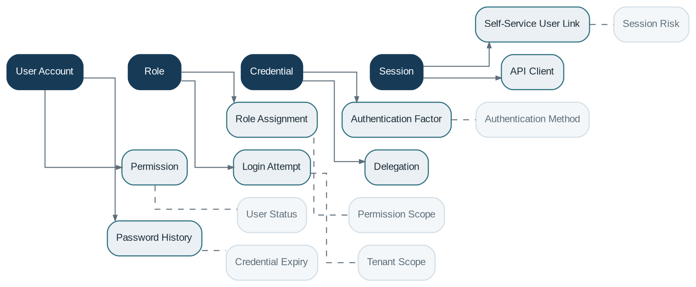

# Identity & Security

> **Capability summary:** Controls authentication, authorization, user lifecycle, roles, permissions, credentials, sessions, self-service access, and segregation-of-duties mechanisms. It determines who may request an action, not whether the domain action is financially valid.

| Attribute | Value |
|---|---|
| Capability number | 03 |
| Category | Platform Capability |
| Architectural layer | Platform Services |
| Primary record | Users, roles, permissions, credentials, and sessions |
| Criticality | High |

## Purpose and Scope

- Create and manage internal and self-service users.
- Authenticate users and establish trusted sessions or tokens.
- Authorize commands and data access through roles, permissions, scopes, and policies.
- Enforce password, lockout, multi-factor, delegation, and maker-checker controls.

## Why It Matters

- Financial systems require strict accountability and least-privilege access.
- Segregation of duties prevents a single user from initiating and approving sensitive operations.
- Centralized authorization avoids inconsistent access rules across product domains and channels.

## Domain Model

| **Aggregate or Core Concept** | **Responsibility**                                                        |
|-------------------------------|---------------------------------------------------------------------------|
| **User Account**              | Security principal used to authenticate and authorize a person or system. |
| **Role**                      | Reusable bundle of permissions and optional organizational scope.         |
| **Credential**                | Authentication secret, key, certificate, or federated identity binding.   |
| **Session**                   | Time-bounded authenticated context with device and channel information.   |

### Supporting Entities

- Permission
- Role Assignment
- Authentication Factor
- Self-Service User Link
- Password History
- Login Attempt
- Delegation
- API Client

### Value Objects and Policy Concepts

- User Status
- Permission Scope
- Authentication Method
- Session Risk
- Credential Expiry
- Tenant Scope

## Lifecycle and Representative Workflows

> **Typical lifecycle:** Invited or Provisioned → Active → Locked → Suspended → Disabled → Archived

1. User provisioning: create identity, assign roles and scope, establish credentials, and activate.
2. Authentication: verify credentials and contextual controls, then issue a session or token.
3. Authorization: evaluate permission, organizational scope, channel, and transaction context before invoking a domain command.

## Relationships with Other Capabilities

| **Related capability**        | **Interaction**                                                                             |
|-------------------------------|---------------------------------------------------------------------------------------------|
| [**Organization Management**](../01-business-capabilities/02-organization-management.md)   | Constrains access by office, region, staff assignment, or tenant.                           |
| [**Workflow & Approval**](../05-platform-capabilities/17-workflow-and-approval.md)       | Uses authenticated actors, roles, and delegation to assign and approve tasks.               |
| [**Administration**](../05-platform-capabilities/22-administration.md)            | Manages privileged operations and security configuration.                                   |
| [**Audit**](../05-platform-capabilities/23-audit.md)                     | Records authentication, authorization, role changes, and privileged actions.                |
| **All Business Capabilities** | Receive a verified actor and authorization decision but still enforce their own invariants. |
| [**Integration**](../05-platform-capabilities/19-integration.md)               | Authenticates external clients, service accounts, and identity providers.                   |

## Distinctive Aspects and Peculiarities

- Authentication and authorization are separate decisions.
- A staff member, customer, system client, and API integration may all be security principals with different controls.
- Permissions should be explicit and composable; broad superuser roles require exceptional governance.
- Maker-checker approval is not a substitute for domain validation.
- Credential and role changes are high-value audit events.

## Representative Commands and Business Events

### Commands

- Create User
- Assign Role
- Revoke Role
- Authenticate
- Refresh Session
- Lock User
- Reset Credential
- Delegate Authority

### Business Events

- User Activated
- Role Assigned
- Authentication Failed
- User Locked
- Credential Reset
- Delegation Granted

## Key Invariants and Design Guardrails

- Every privileged action is attributable to an authenticated principal or trusted system identity.
- Disabled or expired principals cannot initiate new sessions.
- Authorization is evaluated against the requested action and data scope.
- Role and permission changes are auditable and take effect according to policy.

> **Boundary:** Identity & Security decides access. It must not decide product eligibility, accounting treatment, repayment allocation, or other domain outcomes.
