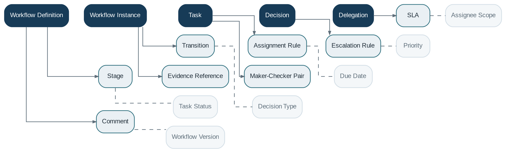

# Workflow & Approval

> **Capability summary:** Orchestrates long-running business processes that require human work, multiple stages, approvals, maker-checker control, conditional routing, delegation, escalation, and complete decision history.

| Attribute | Value |
|---|---|
| Capability number | 17 |
| Category | Platform Capability |
| Architectural layer | Platform Services |
| Primary record | Workflow definitions, instances, tasks, decisions, and escalation history |
| Criticality | High |

## Purpose and Scope

- Define versioned workflows, stages, transitions, conditions, and service-level expectations.
- Create instances and assign tasks to users, roles, teams, or offices.
- Record approvals, rejections, returns, comments, evidence, delegation, and escalation.
- Invoke authorized domain commands only after workflow conditions are satisfied.

## Why It Matters

- Many banking actions cannot be completed in a single technical transaction because they require review and segregation of duties.
- Central orchestration provides consistent task visibility, escalation, and audit across products.
- Workflow separates process coordination from domain invariants and financial logic.

## Domain Model

| **Aggregate or Core Concept** | **Responsibility**                                             |
|-------------------------------|----------------------------------------------------------------|
| **Workflow Definition**       | Versioned graph of stages, tasks, transitions, and conditions. |
| **Workflow Instance**         | Execution state for a specific business case.                  |
| **Task**                      | Unit of human or automated work with assignee and due date.    |
| **Decision**                  | Approval, rejection, return, or exception outcome.             |
| **Delegation**                | Time-bounded transfer of responsibility.                       |

### Supporting Entities

- Stage
- Transition
- Assignment Rule
- Escalation Rule
- SLA
- Comment
- Evidence Reference
- Maker-Checker Pair

### Value Objects and Policy Concepts

- Task Status
- Decision Type
- Due Date
- Priority
- Assignee Scope
- Workflow Version

## Lifecycle and Representative Workflows

> **Typical lifecycle:** Started → In Progress → Waiting → Escalated → Approved → Rejected → Cancelled → Completed

1. Approval workflow: submit business request, route to eligible approver, record decision, and invoke the approved domain command.
2. Exception handling: return for correction, request evidence, escalate overdue tasks, or cancel with reason.
3. Delegation: temporarily redirect eligible tasks without changing business ownership.

## Relationships with Other Capabilities

| **Related capability**                                                          | **Interaction**                                                 |
|---------------------------------------------------------------------------------|-----------------------------------------------------------------|
| [**Identity & Security**](../05-platform-capabilities/03-identity-and-security.md)                                                         | Provides users, roles, permissions, and delegation eligibility. |
| [**Organization Management**](../01-business-capabilities/02-organization-management.md)                                                     | Provides assignment scope by office, region, team, and staff.   |
| **Loan, Customer, Product, Accounting, Collateral, and Administration Domains** | Expose requests and commands that may require approval.         |
| [**Notification**](../05-platform-capabilities/18-notification.md)                                                                | Alerts assignees, requesters, and escalation recipients.        |
| [**Audit**](../05-platform-capabilities/23-audit.md)                                                                       | Preserves task, decision, actor, and evidence history.          |
| [**Configuration**](../05-platform-capabilities/21-configuration.md)                                                               | Defines thresholds, routing policies, and feature enablement.   |

## Distinctive Aspects and Peculiarities

- Workflow authorizes and sequences work; the target domain still validates the command when executed.
- Workflow definitions must be versioned so active instances are not broken by later edits.
- Long-running instances need idempotent transitions and compensation strategies.
- Maker and checker must be distinct according to policy, not merely different session tokens.
- Task reassignment must preserve ownership history and accountability.

## Representative Commands and Business Events

### Commands

- Start Workflow
- Complete Task
- Approve Request
- Reject Request
- Return Request
- Reassign Task
- Delegate Authority
- Escalate Task
- Cancel Workflow

### Business Events

- Workflow Started
- Task Assigned
- Task Escalated
- Request Approved
- Request Rejected
- Workflow Completed
- Workflow Cancelled

## Key Invariants and Design Guardrails

- Every transition is valid for the current workflow definition and state.
- A completed decision identifies actor, authority, timestamp, and evidence.
- Domain commands are not executed before required approvals are complete.
- Workflow history is append-only and auditable.

> **Boundary:** Workflow & Approval owns process state and decisions. It must not duplicate financial calculations or override domain invariants.
