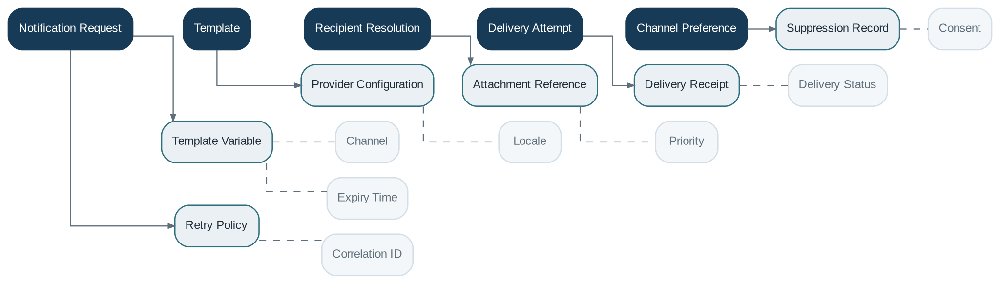

# Notification

> **Capability summary:** Creates, renders, routes, delivers, retries, and records messages triggered by business events, schedules, risks, reminders, or user actions across email, SMS, push, in-app, and other channels.

| Attribute | Value |
|---|---|
| Capability number | 18 |
| Category | Platform Capability |
| Architectural layer | Platform Services |
| Primary record | Notification requests, templates, delivery attempts, and communication history |
| Criticality | High |

## Purpose and Scope

- Define localized, versioned templates and variables.
- Resolve recipients, consent, language, and channel preferences.
- Queue and deliver notifications through providers.
- Track delivery attempts, outcomes, retries, failures, and communication history.

## Why It Matters

- Timely communication improves customer service, collections, security, operational awareness, and regulatory disclosure.
- Asynchronous delivery prevents external provider failures from rolling back valid banking transactions.
- Centralized templates and preferences reduce inconsistent and unauthorized messaging.

## Domain Model

| **Aggregate or Core Concept** | **Responsibility**                                                          |
|-------------------------------|-----------------------------------------------------------------------------|
| **Notification Request**      | Intent to communicate, including event, recipients, priority, and template. |
| **Template**                  | Versioned content for a channel and locale.                                 |
| **Recipient Resolution**      | Resolved address, role, consent, and language context.                      |
| **Delivery Attempt**          | Provider request, status, response, and retry metadata.                     |
| **Channel Preference**        | Permitted or preferred communication methods.                               |

### Supporting Entities

- Template Variable
- Provider Configuration
- Attachment Reference
- Delivery Receipt
- Suppression Record
- Retry Policy

### Value Objects and Policy Concepts

- Channel
- Locale
- Priority
- Delivery Status
- Consent
- Correlation ID
- Expiry Time

## Lifecycle and Representative Workflows

> **Typical lifecycle:** Requested → Rendered → Queued → Sent → Delivered → Failed → Retried → Suppressed → Expired

1. Event notification: consume business event, resolve rule and recipients, render template, queue, deliver, and record outcome.
2. Reminder: calculate upcoming obligation or task, suppress duplicates, and deliver at the configured time.
3. Failure handling: retry transient errors, stop on permanent errors, and surface dead-letter items.

## Relationships with Other Capabilities

| **Related capability**        | **Interaction**                                                         |
|-------------------------------|-------------------------------------------------------------------------|
| [**Customer Management**](../01-business-capabilities/01-customer-management.md)       | Provides contact points, language, consent, and customer relationships. |
| [**Identity & Security**](../05-platform-capabilities/03-identity-and-security.md)       | Provides internal users and secure in-app recipients.                   |
| **All Business Capabilities** | Publish events and request confirmations, alerts, and reminders.        |
| [**Workflow & Approval**](../05-platform-capabilities/17-workflow-and-approval.md)       | Generates task and escalation notifications.                            |
| [**Integration**](../05-platform-capabilities/19-integration.md)               | Connects external email, SMS, push, and messaging providers.            |
| [**Audit**](../05-platform-capabilities/23-audit.md)                     | Records sensitive or mandatory communications.                          |
| [**Configuration**](../05-platform-capabilities/21-configuration.md)             | Defines templates, provider selection, retry, and suppression policies. |

## Distinctive Aspects and Peculiarities

- Notification content should avoid exposing sensitive data beyond the assurance level of the channel.
- Consent, opt-out, mandatory notice, and marketing communication rules differ.
- Delivery status is provider evidence, not proof that a human read the message.
- Templates must be versioned to reproduce what was sent.
- Duplicate suppression is essential when upstream events are retried.

## Representative Commands and Business Events

### Commands

- Create Template
- Request Notification
- Schedule Reminder
- Suppress Notification
- Retry Delivery
- Cancel Pending Notification

### Business Events

- Notification Requested
- Notification Sent
- Notification Delivered
- Notification Failed
- Reminder Triggered
- Notification Suppressed

## Key Invariants and Design Guardrails

- A notification request does not alter the committed business transaction that triggered it.
- Recipients and template versions are resolved and traceable.
- Duplicate event delivery does not produce uncontrolled duplicate communications.
- Channel and consent policies are evaluated before delivery.

> **Boundary:** Notification owns communication lifecycle and evidence. It does not own customer contact data, business obligations, or provider-specific business logic inside domain services.
