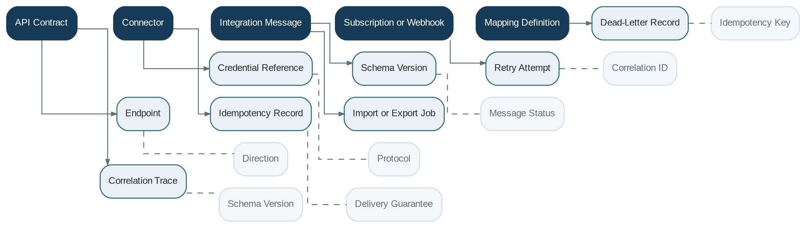

# Integration

> **Capability summary:** Provides controlled interfaces between the core and digital channels, payment networks, identity providers, credit bureaus, document systems, data platforms, and other external applications through APIs, events, messages, connectors, and transformations.

| Attribute | Value |
|---|---|
| Capability number | 19 |
| Category | Platform Capability |
| Architectural layer | Platform Services |
| Primary record | APIs, connectors, messages, mappings, and correlation traces |
| Criticality | High |

## Purpose and Scope

- Expose and govern synchronous APIs and asynchronous events.
- Consume external commands, events, files, and callbacks.
- Transform external schemas into stable internal contracts.
- Manage connectors, correlation, idempotency, retries, dead letters, and integration audit.

## Why It Matters

- A core banking platform operates inside a larger ecosystem and must evolve independently from external systems.
- An anti-corruption layer prevents vendor or channel schemas from contaminating the internal domain model.
- Consistent resilience and traceability reduce duplicate processing and unresolvable interface failures.

## Domain Model

| **Aggregate or Core Concept** | **Responsibility**                                                          |
|-------------------------------|-----------------------------------------------------------------------------|
| **API Contract**              | Versioned synchronous interface and policy.                                 |
| **Connector**                 | Configuration and protocol adapter for an external system.                  |
| **Integration Message**       | Inbound or outbound payload with correlation, schema, and processing state. |
| **Subscription or Webhook**   | Registered recipient for published events.                                  |
| **Mapping Definition**        | Transformation between external and canonical structures.                   |

### Supporting Entities

- Endpoint
- Credential Reference
- Schema Version
- Retry Attempt
- Dead-Letter Record
- Correlation Trace
- Idempotency Record
- Import or Export Job

### Value Objects and Policy Concepts

- Direction
- Protocol
- Message Status
- Correlation ID
- Idempotency Key
- Schema Version
- Delivery Guarantee

## Lifecycle and Representative Workflows

> **Typical lifecycle:** Received or Created → Validated → Transformed → Routed → Acknowledged → Retried → Failed → Dead-Lettered → Reprocessed

1. Inbound command: authenticate, validate contract, enforce idempotency, transform, invoke application service, and return or publish outcome.
2. Outbound event: consume committed domain event, transform, deliver, track acknowledgement, and retry if necessary.
3. Bulk exchange: validate file, stage records, process partitions, reconcile outcomes, and publish a completion report.

## Relationships with Other Capabilities

| **Related capability**      | **Interaction**                                                            |
|-----------------------------|----------------------------------------------------------------------------|
| **All Domain Capabilities** | Expose commands, queries, and events through stable application contracts. |
| [**Identity & Security**](../05-platform-capabilities/03-identity-and-security.md)     | Authenticates clients and protects scopes and credentials.                 |
| [**Payment Processing**](../03-financial-infrastructure/10-payment-processing.md)      | Connects payment rails and settlement services.                            |
| [**Notification**](../05-platform-capabilities/18-notification.md)            | Connects communication providers.                                          |
| [**Reporting**](../04-information-capabilities/16-reporting.md)               | Exports data and regulatory packages.                                      |
| [**Batch Processing**](../05-platform-capabilities/20-batch-processing.md)        | Executes large imports, exports, and reconciliation.                       |
| [**Audit**](../05-platform-capabilities/23-audit.md)                   | Tracks external requests, responses, and transformations.                  |

## Distinctive Aspects and Peculiarities

- Synchronous APIs and asynchronous events have different consistency and failure semantics.
- Schema versioning and backward compatibility are contractual obligations.
- Exactly-once delivery is rarely guaranteed end-to-end; design for idempotent processing.
- Correlation should survive protocol and system boundaries.
- Connector-specific models belong at the edge, not in core aggregates.

## Representative Commands and Business Events

### Commands

- Register Connector
- Publish Event
- Consume Message
- Register Webhook
- Import Data
- Export Data
- Retry Exchange
- Reprocess Dead Letter

### Business Events

- External Request Received
- Integration Message Published
- Webhook Delivered
- Integration Failed
- Dead Letter Created
- Import Completed

## Key Invariants and Design Guardrails

- Every state-changing external request has a defined authentication, authorization, and idempotency policy.
- Internal domain contracts remain independent of external vendor schemas.
- Failed messages are not silently discarded.
- Integration traces identify source, destination, correlation, payload version, and outcome.

> **Boundary:** Integration owns boundary contracts, transport, transformation, and delivery evidence. It must not become the owner of domain decisions or financial state.
