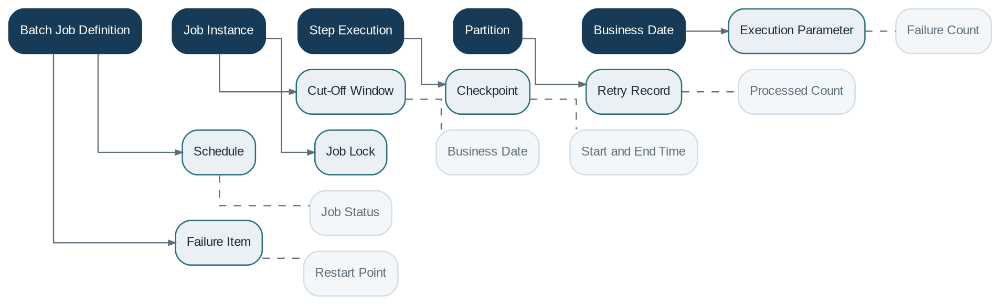

# Batch Processing

> **Capability summary:** Executes scheduled, high-volume, end-of-day, start-of-day, maturity, accrual, delinquency, provisioning, standing-instruction, accounting, reporting, import, and reconciliation workloads with restartability and operational control.

| Attribute | Value |
|---|---|
| Capability number | 20 |
| Category | Platform Capability |
| Architectural layer | Platform Services |
| Primary record | Batch definitions, job instances, steps, checkpoints, and business-date execution |
| Criticality | High |

## Purpose and Scope

- Define jobs, steps, dependencies, parameters, and schedules.
- Run workloads according to business date and cut-off windows.
- Partition large data sets and checkpoint progress.
- Retry failed items, restart interrupted jobs, and preserve complete execution history.

## Why It Matters

- Banking requires periodic processing that cannot or should not occur in interactive customer transactions.
- Business-date control ensures all products recognize the same operational day.
- Restartable, observable batches are essential for end-of-day resilience and regulatory timeliness.

## Domain Model

| **Aggregate or Core Concept** | **Responsibility**                                              |
|-------------------------------|-----------------------------------------------------------------|
| **Batch Job Definition**      | Versioned set of steps, dependencies, parameters, and policies. |
| **Job Instance**              | A scheduled or manually started execution for a business date.  |
| **Step Execution**            | Status, counters, checkpoints, and errors for a job step.       |
| **Partition**                 | Independent slice of a large workload.                          |
| **Business Date**             | Institutional operating date used by financial logic.           |

### Supporting Entities

- Schedule
- Cut-Off Window
- Checkpoint
- Retry Record
- Execution Parameter
- Failure Item
- Job Lock

### Value Objects and Policy Concepts

- Job Status
- Business Date
- Start and End Time
- Processed Count
- Failure Count
- Restart Point

## Lifecycle and Representative Workflows

> **Typical lifecycle:** Scheduled → Starting → Running → Paused → Completed → Failed → Restarting → Cancelled

1. End-of-day: close transaction cut-off, run accruals and fees, update delinquency, post accounting, reconcile, and advance business date.
2. Maturity batch: identify due contracts, calculate proceeds, execute instructions, and record exceptions.
3. Restart: resume from the last durable checkpoint without duplicating completed financial effects.

## Relationships with Other Capabilities

| **Related capability**                                                        | **Interaction**                                             |
|-------------------------------------------------------------------------------|-------------------------------------------------------------|
| **Interest, Fee, Delinquency, Loan, Savings, Deposit, Accounting, Reporting** | Provide batch operations and domain-specific commands.      |
| [**Administration**](../05-platform-capabilities/22-administration.md)                                                            | Schedules, starts, pauses, restarts, and monitors jobs.     |
| **Configuration and Organization Management**                                 | Provide business date, calendars, cut-offs, and parameters. |
| [**Integration**](../05-platform-capabilities/19-integration.md)                                                               | Supports large imports, exports, and settlement files.      |
| [**Audit**](../05-platform-capabilities/23-audit.md)                                                                     | Records privileged interventions and execution history.     |
| [**Notification**](../05-platform-capabilities/18-notification.md)                                                              | Alerts operators to failures and completion.                |

## Distinctive Aspects and Peculiarities

- Business date must be explicit and must not be inferred solely from the server clock.
- Jobs should be restartable and idempotent at step and item level.
- Parallel partitions require deterministic ownership to avoid duplicate processing.
- Financial jobs need cut-off rules and coordination with interactive transactions.
- Operational completion and business completion may differ when exceptions remain.

## Representative Commands and Business Events

### Commands

- Schedule Job
- Start Job
- Pause Job
- Resume Job
- Restart Job
- Cancel Job
- Advance Business Date
- Reprocess Failed Items

### Business Events

- Job Started
- Step Completed
- Job Failed
- Job Restarted
- Job Completed
- Business Date Advanced

## Key Invariants and Design Guardrails

- A restarted job does not duplicate already committed financial effects.
- Only one authoritative end-of-day sequence controls a given business date and scope.
- Execution history and item-level failures are retained.
- Business date advances only after required predecessor conditions are satisfied.

> **Boundary:** Batch Processing owns execution orchestration and history. Domain capabilities own the business rules and state changes performed by each step.
