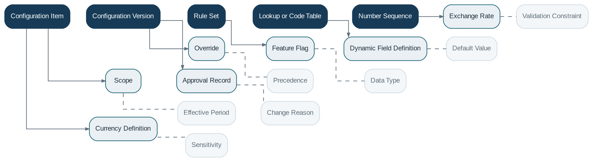

# Configuration

> **Capability summary:** Manages effective-dated, versioned, scoped business and platform parameters: system settings, rules, calendars, currencies, exchange rates, numbering, lookup values, code tables, dynamic fields, feature flags, product overrides, and branch overrides.

| Attribute | Value |
|---|---|
| Capability number | 21 |
| Category | Platform Capability |
| Architectural layer | Platform Services |
| Primary record | Effective-dated configuration, rules, lookups, and override resolution |
| Criticality | High |

## Purpose and Scope

- Define configuration at global, tenant, organization, branch, product, channel, and customer-relevant scopes.
- Manage approval, versioning, effective periods, precedence, and rollback.
- Provide code tables, lookup values, number sequences, currencies, exchange rates, and dynamic metadata.
- Expose validated configuration consistently to all capabilities.

## Why It Matters

- Configuration is the mechanism that turns a core platform into an institution-specific operating model.
- Effective dating and auditability are required because parameter changes can alter future calculations and decisions.
- Centralized precedence rules prevent hidden and contradictory behavior.

## Domain Model

| **Aggregate or Core Concept** | **Responsibility**                                       |
|-------------------------------|----------------------------------------------------------|
| **Configuration Item**        | Named value or structured object within a defined scope. |
| **Configuration Version**     | Approved value set with effective dates and status.      |
| **Rule Set**                  | Configurable decision logic with version and context.    |
| **Lookup or Code Table**      | Governed list of extensible reference values.            |
| **Number Sequence**           | Controlled generator for business identifiers.           |

### Supporting Entities

- Scope
- Override
- Feature Flag
- Dynamic Field Definition
- Exchange Rate
- Currency Definition
- Approval Record

### Value Objects and Policy Concepts

- Effective Period
- Precedence
- Data Type
- Default Value
- Validation Constraint
- Sensitivity
- Change Reason

## Lifecycle and Representative Workflows

> **Typical lifecycle:** Draft → Validated → Approved → Scheduled → Effective → Superseded → Rolled Back → Retired

1. Change management: create draft, validate dependencies, approve, schedule effective date, activate, and supersede prior version.
2. Resolution: determine the applicable value using scope hierarchy, effective date, and override precedence.
3. Rollback: activate a prior or corrective version without erasing the history of the failed configuration.

## Relationships with Other Capabilities

| **Related capability**      | **Interaction**                                                                       |
|-----------------------------|---------------------------------------------------------------------------------------|
| **All Capabilities**        | Consume configuration but remain responsible for interpreting it within domain rules. |
| [**Product Catalog**](../01-business-capabilities/04-product-catalog.md)         | Uses configuration defaults and may provide product-specific overrides.               |
| [**Organization Management**](../01-business-capabilities/02-organization-management.md) | Defines scope and calendars.                                                          |
| [**Workflow & Approval**](../05-platform-capabilities/17-workflow-and-approval.md)     | Approves sensitive changes.                                                           |
| [**Administration**](../05-platform-capabilities/22-administration.md)          | Operates configuration deployment and environment promotion.                          |
| **Audit and Reporting**     | Record changes and expose effective values used in decisions.                         |

## Distinctive Aspects and Peculiarities

- Configuration should not become untyped free-form data; schemas and validation are essential.
- Precedence across global, tenant, branch, product, and contract scope must be deterministic.
- Past calculations must be reproducible using the configuration effective at the relevant time.
- Feature flags control availability, not contractual data migration by themselves.
- Secrets and credentials should use dedicated secure storage rather than ordinary configuration values.

## Representative Commands and Business Events

### Commands

- Create Configuration Draft
- Validate Configuration
- Approve Configuration
- Schedule Activation
- Activate Version
- Rollback Version
- Create Lookup Value
- Advance Number Sequence

### Business Events

- Configuration Approved
- Configuration Became Effective
- Configuration Rolled Back
- Feature Flag Changed
- Exchange Rate Published

## Key Invariants and Design Guardrails

- At most one unambiguous effective value applies for a configuration key and scope resolution.
- Approved versions are immutable; corrections create new versions.
- Sensitive changes require appropriate authorization and evidence.
- Consumers can identify the configuration version used for material decisions.

> **Boundary:** Configuration owns governed parameters and resolution. It must not replace explicit domain modeling or hide essential contractual state in arbitrary key-value pairs.
