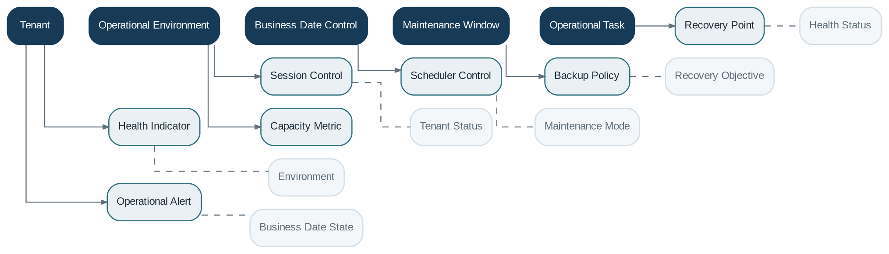

# Administration

> **Capability summary:** Provides the privileged operational control plane for tenants, environments, business dates, sessions, health, schedules, maintenance, backups, operational dashboards, and other activities required to run the platform safely.

| Attribute | Value |
|---|---|
| Capability number | 22 |
| Category | Platform Capability |
| Architectural layer | Platform Services |
| Primary record | Tenant operations, business-date control, health, maintenance, and recovery evidence |
| Criticality | High |

## Purpose and Scope

- Provision and maintain tenants and operational environments.
- Control business date, maintenance mode, scheduled tasks, and operator sessions.
- Monitor health, capacity, job status, integrations, and critical exceptions.
- Coordinate backup, recovery, environment promotion, and operational access.

## Why It Matters

- A banking platform must remain available, recoverable, observable, and controllable under routine and exceptional conditions.
- Privileged operations can have institution-wide consequences and require strong governance.
- A distinct control plane prevents operational concerns from leaking into customer-facing domain logic.

## Domain Model

| **Aggregate or Core Concept** | **Responsibility**                                                  |
|-------------------------------|---------------------------------------------------------------------|
| **Tenant**                    | Isolated institution or business unit with its operational context. |
| **Operational Environment**   | Deployment context and controlled configuration promotion path.     |
| **Business Date Control**     | Current date, cut-off, close, and advance status.                   |
| **Maintenance Window**        | Planned restriction of platform operations.                         |
| **Operational Task**          | Privileged action with state, actor, and evidence.                  |

### Supporting Entities

- Health Indicator
- Session Control
- Scheduler Control
- Backup Policy
- Recovery Point
- Operational Alert
- Capacity Metric

### Value Objects and Policy Concepts

- Environment
- Tenant Status
- Maintenance Mode
- Recovery Objective
- Health Status
- Business Date State

## Lifecycle and Representative Workflows

> **Typical lifecycle:** Provisioning → Active → Restricted or Maintenance → Degraded → Suspended → Decommissioned

1. Business-date operation: verify prerequisites, close the day, run required jobs, reconcile, advance, and reopen.
2. Maintenance: announce, restrict traffic, drain work, apply change, validate, and restore service.
3. Recovery: select recovery point, restore, validate data integrity, reconcile external effects, and resume.

## Relationships with Other Capabilities

| **Related capability**           | **Interaction**                                                           |
|----------------------------------|---------------------------------------------------------------------------|
| [**Identity & Security**](../05-platform-capabilities/03-identity-and-security.md)          | Protects privileged roles, sessions, and emergency access.                |
| [**Batch Processing**](../05-platform-capabilities/20-batch-processing.md)             | Provides job operation and business-date workflows.                       |
| [**Configuration**](../05-platform-capabilities/21-configuration.md)                | Controls runtime and tenant settings.                                     |
| **Integration and Notification** | Expose provider health and operational failures.                          |
| [**Audit**](../05-platform-capabilities/23-audit.md)                        | Records every privileged administrative action.                           |
| [**Reporting**](../04-information-capabilities/16-reporting.md)                    | Provides operational dashboards and service metrics.                      |
| **All Business Capabilities**    | Are observed and controlled but not semantically owned by Administration. |

## Distinctive Aspects and Peculiarities

- Administration is a control plane and should not directly edit business balances or transaction history.
- Emergency access requires time limitation, justification, and enhanced audit.
- Business-date controls have financial meaning and need domain-aware prerequisites.
- Backup success is not equivalent to proven recoverability; restoration must be tested.
- Multi-tenant operations require strict data, configuration, key, and workload isolation.

## Representative Commands and Business Events

### Commands

- Provision Tenant
- Set Maintenance Mode
- Advance Business Date
- Terminate Session
- Start Scheduled Task
- Trigger Backup
- Restore Environment
- Acknowledge Operational Alert

### Business Events

- Tenant Provisioned
- Maintenance Started
- Business Date Advanced
- Privileged Session Terminated
- Backup Completed
- Recovery Completed
- Operational Alert Raised

## Key Invariants and Design Guardrails

- Privileged operations are authenticated, authorized, justified, and auditable.
- Administrative tools cannot bypass immutable financial history.
- Tenant boundaries are enforced in data and execution context.
- Business-date changes satisfy required batch and reconciliation gates.

> **Boundary:** Administration owns operational control and platform state, not customer contracts or financial posting logic.
