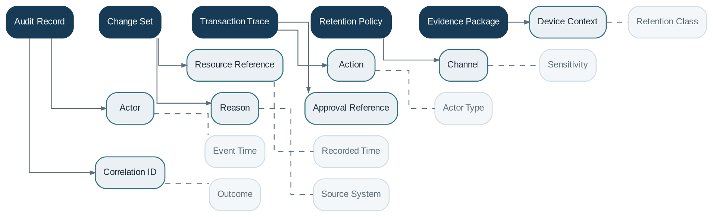

# Audit

> **Capability summary:** Captures immutable, searchable evidence of business, financial, security, configuration, approval, integration, and administrative activity, including actor, time, source, before-and-after data, correlation, and retention.

| Attribute | Value |
|---|---|
| Capability number | 23 |
| Category | Platform Capability |
| Architectural layer | Platform Services |
| Primary record | Immutable activity evidence, change sets, transaction traces, and retention state |
| Criticality | Critical |

## Purpose and Scope

- Record significant commands, decisions, data changes, logins, role changes, approvals, and privileged operations.
- Trace financial transactions across product, payment, accounting, and ledger stages.
- Protect audit evidence from unauthorized alteration or deletion.
- Provide search, export, retention, legal hold, and compliance evidence.

## Why It Matters

- Banking actions must remain explainable long after the original transaction.
- Audit evidence supports dispute resolution, fraud investigation, regulatory examination, internal control, and non-repudiation.
- Central correlation connects activity that spans multiple services and asynchronous stages.

## Domain Model

| **Aggregate or Core Concept** | **Responsibility**                                                                 |
|-------------------------------|------------------------------------------------------------------------------------|
| **Audit Record**              | Immutable statement of an action, event, or decision.                              |
| **Change Set**                | Before-and-after representation of a controlled data change.                       |
| **Transaction Trace**         | Correlated path across business, payment, accounting, GL, and integration records. |
| **Retention Policy**          | Rules for preservation, legal hold, archival, and disposal.                        |
| **Evidence Package**          | Collected records supporting an investigation or control.                          |

### Supporting Entities

- Actor
- Resource Reference
- Action
- Channel
- Device Context
- Correlation ID
- Reason
- Approval Reference
- Integrity Seal

### Value Objects and Policy Concepts

- Event Time
- Recorded Time
- Actor Type
- Sensitivity
- Retention Class
- Outcome
- Source System

## Lifecycle and Representative Workflows

> **Typical lifecycle:** Captured → Sealed → Indexed → Retained → Placed on Hold → Exported → Disposed according to Policy

1. Action audit: capture actor, request, authorization context, result, and affected resource.
2. Change audit: preserve old and new values with reason and approval where required.
3. Investigation: search by customer, transaction, user, time, or correlation and assemble an evidence package.

## Relationships with Other Capabilities

| **Related capability**            | **Interaction**                                                   |
|-----------------------------------|-------------------------------------------------------------------|
| **All Capabilities**              | Publish auditable actions and references.                         |
| [**Identity & Security**](../05-platform-capabilities/03-identity-and-security.md)           | Provides authenticated actor, session, and authorization context. |
| [**Workflow & Approval**](../05-platform-capabilities/17-workflow-and-approval.md)           | Provides decision and evidence history.                           |
| **Accounting and General Ledger** | Provide financial lineage.                                        |
| [**Integration**](../05-platform-capabilities/19-integration.md)                   | Provides external request, message, and provider trace.           |
| [**Administration**](../05-platform-capabilities/22-administration.md)                | Defines retention, access, export, and legal-hold operation.      |
| [**Reporting**](../04-information-capabilities/16-reporting.md)                     | Provides controlled audit and compliance reports.                 |

## Distinctive Aspects and Peculiarities

- Audit logs are not ordinary application logs; they require stronger integrity, retention, and access controls.
- Event time and record-ingestion time may differ and should both be preserved.
- Immutability must coexist with privacy and lawful disposal requirements.
- High-volume audit needs indexing without weakening the authoritative sealed record.
- Correlation IDs are necessary but should not be treated as sensitive authentication secrets.

## Representative Commands and Business Events

### Commands

- Record Audit Event
- Seal Record
- Search Audit
- Create Evidence Package
- Place Legal Hold
- Export Audit Evidence
- Dispose Expired Records

### Business Events

- Audit Record Captured
- Integrity Seal Applied
- Evidence Package Created
- Legal Hold Applied
- Audit Export Performed
- Retention Disposal Completed

## Key Invariants and Design Guardrails

- Authorized users cannot alter sealed audit content.
- Every financial or privileged action has sufficient source and actor trace.
- Retention and disposal follow approved policy and legal holds.
- Access to audit data is itself audited.

> **Boundary:** Audit observes and preserves evidence. It must not participate in domain decisions or become the primary store for business state.
