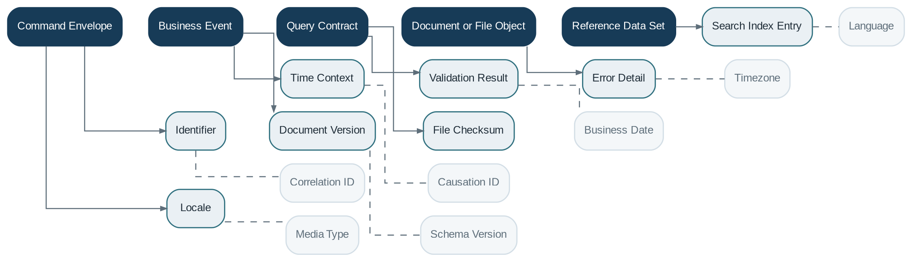

# Platform Services

> **Capability summary:** Provides a deliberately small set of domain-neutral building blocks shared across capabilities: command and query envelopes, business events, validation, identifiers, time context, reference data, documents, files, search, metadata, and localization.

| Attribute | Value |
|---|---|
| Capability number | 24 |
| Category | Platform Capability |
| Architectural layer | Platform Services |
| Primary record | Commands, events, identifiers, time context, documents, reference data, and metadata |
| Criticality | High |

## Purpose and Scope

- Provide consistent command, query, event, validation, and error conventions.
- Generate identifiers and supply authoritative business time and timezone context.
- Manage shared documents, file storage, search indexes, reference data, and metadata definitions.
- Provide localization and technical abstractions without absorbing business-domain ownership.

## Why It Matters

- Common technical conventions reduce duplicated infrastructure and make cross-capability behavior predictable.
- Shared time, identifier, event, and validation semantics are especially important in a distributed or generated implementation.
- A disciplined shared kernel enables reuse while preserving domain boundaries.

## Domain Model

| **Aggregate or Core Concept** | **Responsibility**                                                                |
|-------------------------------|-----------------------------------------------------------------------------------|
| **Command Envelope**          | Request to change state with actor, correlation, idempotency, and timing context. |
| **Business Event**            | Immutable fact that a meaningful state change occurred.                           |
| **Query Contract**            | Read request and projection result.                                               |
| **Document or File Object**   | Stored binary or structured evidence referenced by domains.                       |
| **Reference Data Set**        | Shared governed codes and values.                                                 |
| **Metadata Definition**       | Description of configurable fields and entity extensions.                         |

### Supporting Entities

- Identifier
- Time Context
- Validation Result
- Error Detail
- Search Index Entry
- Locale
- Document Version
- File Checksum

### Value Objects and Policy Concepts

- Correlation ID
- Causation ID
- Business Date
- Timezone
- Language
- Media Type
- Schema Version

## Lifecycle and Representative Workflows

> **Typical lifecycle:** Requested → Validated → Executed → Published or Indexed → Superseded or Archived

1. Command processing: establish context, authorize, validate, execute atomically, publish events, and return a stable result.
2. Document flow: upload, scan or validate, version, associate with a domain reference, retain, and archive.
3. Search indexing: consume committed events, update index asynchronously, and reconcile drift.

## Relationships with Other Capabilities

| **Related capability**         | **Interaction**                                                     |
|--------------------------------|---------------------------------------------------------------------|
| **All Capabilities**           | Use shared envelopes and services while retaining domain ownership. |
| [**Identity & Security**](../05-platform-capabilities/03-identity-and-security.md)        | Provides actor and authorization context.                           |
| [**Integration**](../05-platform-capabilities/19-integration.md)                | Exposes commands, queries, and events externally.                   |
| [**Audit**](../05-platform-capabilities/23-audit.md)                      | Consumes correlation and causation context.                         |
| [**Configuration**](../05-platform-capabilities/21-configuration.md)              | Defines reference data, metadata, and localization settings.        |
| **Notification and Reporting** | Use document, localization, and file services.                      |
| [**Administration**](../05-platform-capabilities/22-administration.md)             | Operates storage, indexing, and shared technical services.          |

## Distinctive Aspects and Peculiarities

- The shared kernel should remain small; business concepts such as Loan, Customer, or Charge do not belong here.
- Business events describe committed facts, not commands or tentative requests.
- Time service must distinguish system time, business date, posting date, value date, and timezone.
- Identifiers require stable scope and generation semantics.
- Search indexes and caches are projections, not authoritative business stores.

## Representative Commands and Business Events

### Commands

- Execute Command
- Run Query
- Publish Business Event
- Generate Identifier
- Store Document
- Version Document
- Index Resource
- Manage Reference Data

### Business Events

- Command Accepted
- Business Event Published
- Document Stored
- Reference Data Changed
- Search Index Updated

## Key Invariants and Design Guardrails

- Shared services do not bypass domain authorization or validation.
- Committed events are uniquely identifiable and carry correlation and causation context.
- Authoritative business state remains in the owning capability.
- Projection failures are recoverable without corrupting source transactions.

> **Boundary:** Platform Services provides reusable technical primitives. It must resist becoming a generic “miscellaneous” domain or a place where capability-specific rules accumulate.
